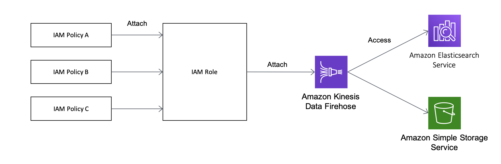
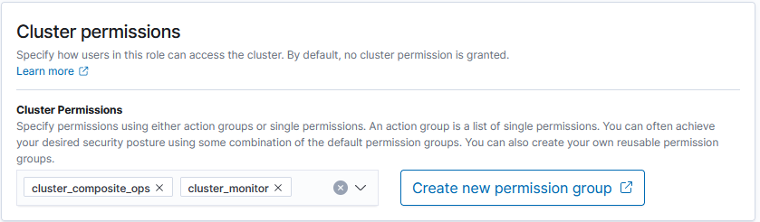

# Lab 1: Setting Up Your Environment

In this Lab, you will set up the environment required for the following Labs. The architecture of the system that you will configure in this Lab1 is as follows.


This system uses a JavaScript based tool called Kinesis Data Generator to generate logs for analysis. This tool performs authentication and authorization for sending logs using a service called Amazon Cognito. Then, Kinesis Data Generator sends logs with the designated format to a log aggregation service called Amazon Kinesis Firehose (hereafter, Firehose). Logs sent to Firehose are written in Amazon Elasticsearch Service (hereafter, Amazon ES) after collecting data with designated intervals. Amazon ES bundles browser-based visualization and analysis software called Kibana. Using this Kibana, you will perform visualization and aggregation of logs from the browser. Amazon ES monitors data and send alerts to a notification service called Amazon Simple Notification Service (hereafter, Amazon SNS) in case of any issues.

## Section 1: Creating an Amazon ES Domain

In this section, you will create an Amazon ES domain. In Amazon ES, Elasticsearch clusters are called domains. When the process of domain creation is performed, a new virtual machine starts up in the backend, and then the setup for Elasticsearch cluster will start.


### Creating an Amazon ES Domain

1. Log in to the AWS Management Console. After logging in, confirm that **[N. Virginia]** is chosen by the region selector in the right of the header in the console screen. If **[N. Virginia]** is not chosen, click the region name and change to **[N. Virginia]**.
2. Click [Services] in the top left of the AWS Management Console to display a list of services, and choose **[Elasticsearch Service]** (The search window in the top of the condole screen allows you to narrow down the service by entering such as **"elasticsearch"**). Go to Elasticsearch, click **[Create a new domain]** button to proceed to the domain creation.
3. In **"Step 1: Choose deployment type"**, choose **["Development and testing"]** in **"Deployment type"**. Do not change the version, and click **[Next]**.
4. In **"Step 2: Configure domain"**, enter **"workshop-esdomain"** in **"Elasticsearch domain name"**. Do not change the rest, and click **[Next]**.
5. In **"Step 3: Configure access and security"**, choose **[Public access]** in **"Network configuration"**. Then, choose **[Create master user]** in in **"Fine–grained access control"**. The master user account you will created here is used to log in to the visualization tool Kibana on Amazon ES. Enter any **master user name** and **master password** by following the instructions. The master user name must be between 1 and 16 characters. The master password must be at least 8 characters long and contain at least one uppercase letter, one lowercase letter, one number, and one special character. The user name and password you set here will be used in Section 3.
6. Next, set an access policy. Click [here](https://www.cman.jp/network/support/go_access.cgi) to confirm your IP address. Then, choose **[Custom access policies]** in **Domain access policy**, and choose **[IPv4 address]** in the item below. In the blank to the right, enter your IP address that you have confirmed in the above, and choose **[Allow]** on the right item. Click **[Next]** at the bottom of the screen after setting up to here.
   
7. In **"Step 4: Review"**, review the settings you have made in the above, and if there is no concern to them, click **[Confirm]** at the bottom right of the screen to create the domain. It takes approximately 15 minutes to create the domain. Meanwhile, move onto a Firehose stream creation in Section 2.

### Explanation: About Amazon ES

In this hands-on, Elasticsearch has been configured with only one machine due to just a trial. However, Elasticsearch essentially can handle large data and obtain high availability by configuring clusters on multiple machines. Therefore, when running Amazon ES in production, prepare multiple master nodes dedicated to managing clusters as well as multiple data nodes to store actual data.

A typical Easticsearch cluster in Amazon ES consists of the following. Distribute nodes across three or more Availability Zones (hereafter AZ) in an AWS Region to keep the cluster running in a highly available in the event of a failure in a single AZ. Setting up your own Elasticsearch cluster with this configuration on EC2, and upgrading software and changing its settings can be a very hard task. But you can launch it with such a configuration with only for a few clicks using Amazon ES.


The master node can be cohabitation with the data node, however in case of large clusters or heavy workloads, it is recommended to provide a dedicated master node that only manages the cluster. For the master node, it is recommended to be set with odd number of 3 units number or more. In Amazon ES, you can choose 3 or 5 units for the master node. For more information of the reason why even numbers cannot be used,  please see [the official document](https://docs.aws.amazon.com/ja_jp/elasticsearch-service/latest/developerguide/es-managedomains-dedicatedmasternodes.html).


## Section 2: Creating a Firehose Stream

In this section, you will create a Firehose stream that you can use to insert logs into Amazon ES.


### Creating a Firehose Stream

1. In a similar manner with the Section 1, confirm that **[N. Virginia]** is chosen by the region selector in the right of the header in the console screen. If **[N. Virginia]** is not selected, click the region name and change to **[N. Virginia]**.Then, go to the **[Kinesis]** page from [Service] in the top left of the AWS Management Console screen.
2. Choose **[Kinesis Data Firehose]** in Get started in the right top of the screen. Then, click **[Create delivery stream]** to go to the Firehose stream creation page.
3. In **"Step 1: Name and source"**, enter **"workshop-firehose"** in **"Delivery stream name"**. Then, click **[Next]** without changing any other settings
4. In **"Step 2: Process records"**, does not change anything, and click **[Next]**.
5. In **"Step 3: Choose a destination"**, choose **[Amazon Elasticsearch Service]** in **"Destionation"**. Then, in **"Domain"** at **"Amazon Elasticsearch Service destination"**, choose **["workshop-esdomain"]** you have created in Section 1. You can now automatically send logs into Amazon ES above.If Domain is in Processing status, wait until it is selectable.
6. Enter **"workshop-log"** in **"Index"**. Amazon ES Index is equivalent to a table in DB in a simple analogy, but the log sent from this Firehose stream will be inserted into the index called workshop-log. If there is no Index on the Amazon ES in inserting, an Index is automatically created.
7. Choose **[Every hour]** from the pull-down menu in **“Index rotation”**. With this setting, a new index is created every hour. The index name is also created with the date and time, such as "workshop-log-2020-04-01-09". This makes it possible to separate the data flowing in the stream by a certain date and time (the meaning of using this setting will be explained in more detail in Lab 3).
8. In **"S3 backup"** below, click **[Create new]** button on the right of **"Back up S3 bucket"** to go to Create S3 bucket. In **"S3 bucket name"**, enter **"workshop-firehose-backup-YYYMMDD-YOURNAME"** (Replace YYYMMDD with today's date, for example, 20200701. And then, replace YOURNAME with your name like taroyamada. In this case, the bucket name will be “workshop-firehose-backup-20200701-taroyamada”). This bucket is used to store a backup of records that fail when inserting them from Firehose into Amazon ES.
9. In **"Step 4: Configure settings"**, click **[Cteate new or choose]** button in “Permission” at the bottom. In **"IAM roles"**, choose **[Create a new IAM role]**, enter **"workshop_firehose_delivery_role"** in **"Role name"**, and  click **[Allow]** button. Then, click **[Next]** when you return to the bottom screen.
10. In **"Step 5: Review"**, review the settings you have entered in the above, and if there is no concern to them, click **[Create delivery stream]** to create a domain. It takes a few minutes to create the stream.

### Explanation

IAM stands for Identity and Access Management and is a service for managing access rights to AWS service resources. It is written in the following format. In this case, you can create a EC2 instance, and also list and read or write objects that exist in the S3 bucket called my-bucket. This set of permissions is called a policy. As mentioned in the Firehose steps above, you need to allow Firehose streams to write error data to an S3 bucket and insert data into Amazon ES.

```json
{
    "Version": "2012-10-17",
    "Statement": [
        {
            "Sid": "",
            "Effect": "Allow",
            "Action": [
                "ec2:RunInstances",
            ],
            "Resource": "*"
        },
        {
            "Sid": "",
            "Effect": "Allow",
            "Action": [
                "s3:GetObject",
                "s3:ListBucket",
                "s3:PutObject"
            ],
            "Resource": [
                "arn:aws:s3:::my-bucket",
                "arn:aws:s3:::my-bucket/*"
            ]
        }
    ]
}
```

This creates an IAM role with multiple attached policies, and enabling Firehose to access each service using this IAM role. These are summarized in the diagram below.



## Section 3: Setting Amazon ES Permissions

You have created the Amazon ES domain and the Firehose stream to insert logs into it. However, Firehose cannot send logs to Amazon ES because you have not set the appropriate permissions yet. In this section, you will use Kibana which is a web interface on Amazon ES to give Firehose permission to insert logs.


### Amazon ES Permission Model

Amazon ES is based on Open Distro for Elasticsearch, which is an open-source Elasticsearch distribution. Open Distro has original permission management model that you can use it with Amazon ES. The permissions model of Open Distro is as follows and consists of Role and Role Mappings.

**Role**: A unit of various privileges of Elasticsearch. For example, you can set a development role that is granted permission to manipulate the cluster itself, add or delete data, and a reader role that can read only specific log data on the cluster. Elasticsearch has several pre-defined roles.

**Role Mappings**: A mapping that indicates the association of Elasticsearch Role defined above with AWS IAM users, and IAM roles. This allows specific IAM roles to perform the required Elasticsearch manipulation.

In this section, you will define a new write role with permission to add logs to Amazon ES, and associate this role with the IAM role for Firehose on AWS.These are summarized in the diagram below. The role which is the same word is used in AWS IAM and Open Distro, so that it makes you confuse easily. But they are completely different. AWS IAM roles are for managing permissions on AWS, and Open Distro roles are for managing permissions on Elasticsearch clusters.This is the role of Role Mappings in Open Distro to connect them together.


### Creating an Amazon ES Role

1. Go to **[Amazon ES]** from [Service] in the top left of the AWS Management Console.
2. Click **[workshop-esdomain]** you have created in the above　on the Amazon ES dashboard.　When the domain details are displayed, click the URL next to **"Kibana"**.　The login screen for Kibana is displayed, so that enter the master user and the master password specified in the Section 1.
3. Choose **[Explore on my own]** on the screen after logging in. Then, click  mark on the left of the screen to open the security settings menu.
4. Click **[Roles]** under **"Permissions and Roles"** to go to the role management screen. Then, click + button on the right side of the screen to create a role for inserting logs into Amazon ES.
   
5. Enter **"workshop_firehose_delivery_role"** in **"Role name"**. Then, choose the upper **[Cluster Permissions]** tab to open the menu of cluster permission setting, and click **[+ Add Action Group]** button. Next, choose **[cluster_composite_ops]** from the pull-down menu. Then, click **[+ Add Action Group]** button again, and add **[cluster_monitor]**. These permissions are used to read cluster information, and are predefined in Open Distro. For more information, please click [here](https://opendistro.github.io/for-elasticsearch-docs/docs/security-access-control/default-action-groups/#cluster-level). The diagram below shows you the configuration you have set the steps above.
   
6. Choose the upper **[Index Permissions]** tab, and click **[Add index permissions]** button. Then, enter **"workshop-log-*"** including the index name designated in Firehose earlier in **"Index patterns"**. The real index name will be created with a date in the end of the name like "workshop-log-2020-04-01-09", therefore all those should be included. Next, set the action to grant the permission to this index under **"Permissions:Action Groups"**. Then, click **[+ Add Ation Group]**, and choose **[create_index]** from the pull-down menu. In a similar manner, add **[manage]** and **[crud]** from **[+ Add Ation Group]**. The final state will be as follows.
   
7. Click **[Save Role Definition]** button at the bottom of the screen to create the role.

### Mapping Open Distro Roles with IAM Roles

1. Go to **[Kinesis]** page from [Services] on the top left of the AWS Management Console.　From **"Kinesis Firehose Stream"** in the top right of the screen, choose **[workshop-firehose]** you have created in this Lab.　On the stream details screen, click the link **[workshop_firehose_delivery_role]** displayed in **"IAM role"**.
2. In the IAM management console, click **"arn:aws:iam::123456789012:role/workshop_firehose_delivery_role"** to the right of **"Role ARN"**. (tthis value is different individually, so that make sure it on the screen and then copy it) This is the IAM role that manages permissions to AWS resources for Firehose.
3. Go back to the management screen for Kibana. Next, click  icon on the left of the screen to open the security settings menu. Then, click **[Role Mappings]** under **"Permissions and Roles"** to go to the Role Mapping screen.
4. Click + button on the right of the screen to open the new mapping screen.From the pull-down menu under **"Role:"** at the top of the screen, choose **[workshop_firehose_delivery_role]** you have created in the above. Then, click **[+ Add Backend Role]** button in **"Backend roles"**, and paste the string of Role ARN you have copied in the above.
5. At last, click **[Submit]** to complete the mapping.

## Section 4: Setting Up Kinesis Data Generator

In this section, set up the Kinesis Data Generator. Kinesis Data Generator is a web application developed and provided as a service by AWS to generate logs flowing into Kinesis. To learn more about this service, please read [this article](https://aws.amazon.com/jp/blogs/news/test-your-streaming-data-solution-with-the-new-amazon-kinesis-data-generator/).


### Creating Required Resources with CloudFormation

1. Click [here](https://console.aws.amazon.com/cloudformation/home?region=us-west-2#/stacks/new?stackName=Kinesis-Data-Generator-Cognito-User&templateURL=https://aws-kdg-tools.s3.us-west-2.amazonaws.com/cognito-setup.json) to start with the CloudFormation stack creation screen. Kinesis Data Generator uses a service called Amazon Cognito at the backend for login authentication and authorization of log sending permissions. By creating this CloudFormation stack, you can create the necessary Cognito resources.
2. In **"Step 1: Specify template"**, make sure that the Amazon S3 URL where the template source is located has already entered. This CloudFormation stack creation is only available in the Oregon region. Therefore, the region selection in the top right of the screen is set to **[Oregon]**, so click **[Next]** without any changes.
3. In **"Step 2: Specify stack details"**, enter the appropriate value for **"Username"** and **"Password"** for **"Kinesis Data Generator"**. The username and password specified here will be used to log in to Kinesis Data Gnerator later. Once you have entered, click **[Next]**.
4. In **"Step 3: Configure stack options"**, click **[Next]** without any changes.
5. In **"Step 4: Review"**, check the check-box of **"I acknowledge that AWS CloudFormation might create IAM resources with custom names "** at to bottom of the screen, and then click **[Create stack]** button to start the stack creation.
6. Wait for a few minutes until the stack status changes  CREATE_COMPLETE.

### Sending Logs from Kinesis Data Generator

1. Choose **[Output]** tab of the CloudFormation stack you have created. You can open the setting screen of Kinesis Data Generator by clicking the URL of **"KinesisDataGeneratorUrl"** displayed.

2. Enter the user name and password you have created in the the above step to **"Username"** and **"Password"** in the top right of the screen, and then login to it.

3. Configure the log transfer setting actually in this step. In **"Region"**, choose **[ap-northeast-1]** ( N. Virginia region), and then choose **[workshop-firehose]** you have created earlier in **Stream/delivery stream**.

4. Enter **"5"** to **Records per second** (the number of log records generated per second). This means that 5 records are created per 1 second. As a result 300 records are generated in one minute, and then sent to Firehose.

5. In **"Record template"** below, delete the sample format written under **"Templete 1"**, and copy and paste the following codes. This specifies the format for logging sent from IoT sensors. It automatically generates dummy log data using such as random numbers.

   ```json
   {
       "sensorId": {{random.number(50)}},
       "currentTemperature": {{random.number(
           {
               "min":10,
               "max":150
           }
       )}},
       "ipaddress": "{{internet.ip}}",
       "status": "{{random.weightedArrayElement({
           "weights": [0.90,0.02,0.08],
           "data": ["OK","FAIL","WARN"]
       })}}",
       "timestamp": "{{date.utc("YYYY/MM/DD HH:mm:ss")}}"
   }
   ```

6. When clicking [Test template] at the bottom of the screen, you can check the sample of the log being actually sent. You can see that five records are generated as follows:

   ```json
   {    "sensorId": 42,    "currentTemperature": 38,    "ipaddress": "29.233.125.31",    "status": "OK",    "timestamp": "2020/03/03 12:49:12"}
   ```

7. If there is no matter, click **[Send data]** button at last to start sending the log. The Data continues to be sent to Firehose until you click [Stop Sending Data to Kinesis] displayed in the pop-up menu or close the browser tab.

## Section 5: Creating a Topic for Amazon SNS

In this section, you will create a topic for Amazon SNS and email delivery settings for notifications.


### Creating a topic for Amazon SNS

A topic in SNS is a unit for managing notifications. In Lab 3, Amazon ES will send alert notifications to this topic.

1. Go to **[SNS]** page from **[Services]** in the top left of the AWS Management Console. Next, click the menu icon on the left of the screen to click Topics. Then, click **[Create topic]** button on the right to go to the topic creation screen.
2. Enter **"amazon_es_alert"** in **"Name"**, **"amazon_es_alert"** in **"Display name"**, and click **[Create topic]** button.
3. When you find the topic you have created in the topic list, copy the ARN that is in the right (the string is like  `arn:aws:sns:ap-northeast-1:123456789012:amazon_es_alert` ). You will create IAM roles later and use them in Lab 3.

### Creating a Subscription

Now, you will create a subscription here. This specifies the settings where you want to subscribe the topics and receive notifications. You will register email to subscribe the topic created above.

1. Click **[Subscriptions]** in the left menu to click **[Create subscription]** button on the right. Next, Choose the topic you have created in the above from the Topic ARN. Then, choose **[Email]** as a protocol, and enter your email address to receive notifications at the endpoint.
2. Once you have completed the above settings, click **[Create subscription]** to complete the creation.
3. Within a few minutes, you will receive the email titled "AWS Notification - Subscription Confirmation" from Amazon SNS to the email address you have entered in the above, so that click **[Confirm subscription]** link in the email body to complete the setting.

### Creating an IAM Role

At last, you will create an IAM role to send notifications from Amazon ES to SNS topics.

1. Go to the IAM console in the Management Console, and choose the menu in the order of **[Roles]** > **[Create role]**. On the creation page, click **[AWS service]**, click **[EC2]** under **"Common use cases"**, and then click **[Next: Permissions]** button.

2. Click **[Create policy]** button to open a new browser tab. Next, choose **[JSON]** tab there, and overwrite it with the following codes. In addition, replace "SNS_TOPIC_ARN" in the codes below with the ARN of SNS topic you have copied earlier. When completed, click **[Check policy]** button at the bottom of the screen.

   ```json
   {
     "Version": "2012-10-17",
     "Statement": [{
       "Effect": "Allow",
       "Action": "sns:Publish",
       "Resource": "SNS_TOPIC_ARN"
     }]
   }
   ```

3. Enter **"amazones_sns_alert_policy"** in **"Name"**, and click **[Create policy]**. When completed, close this browser tab, and go back to the role creation screen.

4. On the role creation screen, click the reload button at the top right, and then enter **"amazones_sns_alert_policy"** in the filter to narrow the policy.After checking the policy you have created, click **[Next: Tag]**.

5. Do not make any changes on the tag settings screen, click **[Next: Review]** button.

6. After entering **"amazones_sns_alert_role"** in "Role name", click **[Create role]** button to complete the role creation.

7. Go back to the Roles page, and then enter **"amazones_sns_alert_role"** in the search box to choose the role you have created. When the details screen for the role is displayed, click **[Trust relationships]** tab at the bottom to click **[Edit trust relationship]** button. After entering the edit screen, replace the existing codes with the following codes. This is the setting to make this role available from the Amazon ES domain (es.amazon.com).

   ```json
   {
     "Version": "2012-10-17",
     "Statement": [
       {
         "Effect": "Allow",
         "Principal": {
           "Service": "es.amazonaws.com"
         },
         "Action": "sts:AssumeRole"
       }
     ]
   }
   ```

8. Click **[Update Trust Policy]** button at the bottom of the screen to go back to the previous screen.
9. When you go back, copy the value of "Role ARN" (the string is such as `arn:aws:iam: :123456789012:role/amazones_sns_alert_role`) in the IAM Role details screen. This string will be used in Lab 3.

Now, you have completed to set up Amazon SNS.

## Summary

In Lab 1, you have set up the required environment for the later Lab. This allows Firehose to aggregate data generated by Kinesis Data Generator, insert it into Amazon ES, and check Amazon ES data from Kibana. Please proceed to [Lab 2](../lab2/README.md).