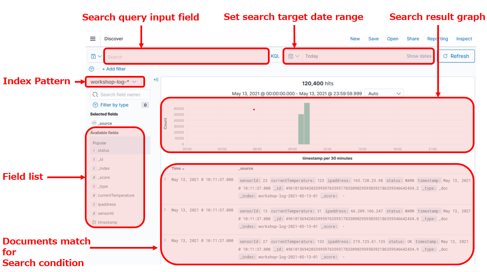

# Lab 2: Kibana での可視化と分析

この Lab では，Kibana を使って Kinesis Data Gnerator で生成されたログデータを可視化・分析していきたいと思います．

## Section 1: Index pattern の設定

### Kibana の概要

ここからは，基本的に Kibana を使って分析を行なっていきます．Kibana は Elasticsearch をバックエンドとして，ストリームデータの可視化・分析を行うことができるウェブアプリケーションです．下図に Kibana のメインの分析画面を示します．


画面左側のアイコンがメニューボタンになっています．各メニューの内容を上から順に述べると，以下のようになります．

- **Discover**: Elasticsearch に溜まったデータを検索クエリで絞り込んだり，その結果をグラフ表示する画面．あらかじめ index pattern と呼ばれる，検索用のデータセットを作成しておく必要がある
- **Visualize**: データセットから，グラフコンポーネントを作成する画面
- **Dashboards**: Visualize で作成したグラフを複数並べて，ダッシュボードを作成する画面
- **Index Management Kibana**: Elasticsearch に格納されている index の管理を行う画面
- **Alerting**: Elasticsearch に格納されたデータが特定の条件に当てはまる場合に，アラートをあげるための設定画面
- **Dev Tools**: Elasticsearch に対して，直接 API を叩いて処理を実行できる開発画面
- **Management**: 分析用データセットである index pattern を管理したり，Kibana の詳細設定を行ったりできる画面
- **Security**: ユーザーやデータの権限管理に関わる，セキュリティの管理画面
- **Tenants**: Kibana のグラフやダッシュボードを公開するためのグループ（これを Kibana ではテナントと呼びます）の設定画面
- **Account**: ログインアカウントの管理画面

上記のうち主な機能については，このハンズオンで実際に触れていきたいと思います．そこでまず，Elasticsearch の基本的なデータのまとまりである index について触れた上で，これを Kibana で分析する際のデータセットとなる index pattern を作成してみましょう．

### Elasticsearch と Index

Elasticsearch では，index と呼ばれる単位でデータを管理し，その中には複数の document が含まれます．また document は複数の field を含みます．これは一般的なリレーショナルデータベースにおけるテーブルとレコード，そしてカラムに近いものだと考えていただけるとよいでしょう．また document がどのような field をどんな形式で保持するかといった詳細を定義したものを mapping と呼びます．mapping を定義することで，より細かい挙動を制御することができるようになりますが，あらかじめ mapping を指定しなくても，未定義の index に対してデータを挿入すると，Elasticsearch 側で自動的にレコード内容をもとに mapping を作成してくれます．Lab 1 で作成した Firehose ストリームからのデータについては，自動での mapping 作成を活用しています．


### Index pattern の作成

それでは早速，Lab 1 で作成した index を読み取るための index pattern を作成していきましょう．

1. 画面左側メニューのアイコンをクリックして，Management 画面を開き，左側の **[Index Patterns]** を選択します．続いて **[Create index patterns]** ボタンを押して，index pattern の作成画面を開いてください
2. **"Step 1 of 2: Define index pattern"** の **"index pattern"** に **"workshop-log-\*"** と入力して，**[ > Next step]** ボタンをクリックします．ここで最後につけてある \* はワイルドカードと呼ばれるもので，複数の index をマッチさせるために使用できます．今回は 1 時間ごとにログがローテーションする設定にしていますので，"workshop-log-2020-04-01-09"，"workshop-log-2020-04-01-10"，"workshop-log-2020-04-01-11" と異なる名前の index が 1 時間ごとに生成されていきます．ワイルドカードを用いることで，この index pattern では，これらすべてを検索対象に含めるすることができます 
3. **"Step 2 of 2: Configure settings"** で **"Time Filter field name"** のプルダウンメニューから **[timestamp]** を選択します．Kibana では，ストリームで流れてくるデータを時系列で並べて可視化するのが，非常に一般的なユースケースです．その際の時系列で集約するためのキーを，ここで指定しています．Lab 1 の Kinesis Data Generator で指定したログフォーマットに含まれている "timestamp" というフィールドが，Elasticsearch に自動で日付型データとして認識されています
4. **[Create index pattern]** ボタンを押して，新しい index pattern を作成します

これで事前準備は完了です．それではいよいよデータを眺めてみましょう．

### 解説

ログデータを Elasticsearch に追加して分析する場合，追加したての新しいデータはよくアクセスされますが，古いデータは滅多にアクセスされないことが多くあります．そのため古いデータはアーカイビングしたり，場合によっては削除したくなることもあるでしょう．その際に，全てのデータを同じ index に入れ込む運用だと，そのなかの特定のレコードをいちいち取り出して処理したりする必要があります．また index 自体を書き込み不可にしたり，データのレプリケーションをしたり，といったいくつかの操作は，そもそも index 単位でしか設定できず，個々の document に対しては行うことはできません．

そのためデータを追加する際に，一定期間ごとに書き込む先の index を変えるといった運用形態をとることがよくあります．分析する際も，index pattern をワイルドカード付きで指定することにより，全期間の index を横断して分析することができます．このワークショップでも，そのような習慣に倣って同様の形式でログデータを扱うことにしました．時間経過に伴う index 設定の変更を行う方法については，次の Lab 3 で実際に試してもらえます．

## Section 2: Discover を用いたデータの確認

このセクションでは，先ほど作成した Index pattern のデータを探索していきます．Kibana でデータを眺めるためのツールとして，Discover というものがありますので，こちらを使ってみましょう．Discover の画面説明は以下の通りです．



### Discover によるデータの可視化

1. 画面左側メニューのアイコンをクリックして，Discover のページを開きます
2. 画面左上にある Index pattern 選択のプルダウンメニューから，**[workshop-log-*]** を選びますそうすると棒グラフが表示され，その下に Document がズラッと並ぶのが確認できるかと思います．．また画面右上にある，検索対象時間を指定するメニューのカレンダーボタンをクリックして，**"Commonly used"** にある **[Today]** をクリックしてください．今日のログをすべて表示してくれます．ここの値をいじることで，表示・検索範囲を変更できます
3. Document の中身をみてみると，Lab 1 で指定したテンプレートと同じ sensorId, currentTemperature, Ipaddress. starus, timestamp といったフィールドが，こちらにも表示されているのが見て取れるでしょう． さらに _id, _type, _index, _score といった指定していないフィールドもありますが，こちらは Elasticsearch が自動で追加するメタデータになります
   
4. 続いて，画面左上の検索フィールドに，`status:WARN` と入力して，右側の **[Update]** ボタンを押してください．ここで入力した内容がフィルター条件として機能することで，画面に表示される Document が WARN ステータスのものだけになり，かつ WARN にハイライトがかかって表示されます．また同様に，`status:FAIL|WARN` と入力することで，FAIL または WARN の Document が表示されます
5. 続いて `currentTemperature>100` と入れて **[Update]** をしてみてください．温度 100 度以上のレコードだけに絞ることができます．もちろん複数条件を組み合わせることもできます．`currentTemperature>100 and status:WARN` とすることで，温度 100 度以上かつ WARN のレコードのみを検索できます．また `(currentTemperature > 120 and status:WARN) or sensorId:10`とすることで，OR 条件も組み合わせた検索ができます．さらに`ipaddress:1*` とすることで，IP アドレスが 1 から始まるレコードだけに絞ることも可能です．色々な検索条件を試してみてください
6. この状態で左側の Field 一覧のうち，**[stauts]** をクリックしてみてください．この Field に含まれる WARN, OK, FAIL のそれぞれについて，検索結果における各アイテムの比率が表示されます．ただしこの値は全量を見たものではなく，概算の値である点に注意してください

## Sction 3: Visualize によるグラフの作成

次に，グラフの作成を試してみましょう．Kibana には Visualize というグラフ作成・描画ツールがあります．ただ Visualize の機能を使うためには，Elasticsearch の用語を理解する必要があります．いくつ かのグラフ描画を通じて，グラフ作成の考え方を説明していきます．Visualize 画面の説明は以下の通りです．


###  OK, WARN, FAIL の各ステータスの割合の可視化

ここではまず，全レコードに占める OK, WARN, FAIL の各ステータスの割合を可視化するために，円グラフを作成してみます．

1. 画面左側メニューの  アイコンをクリックして，Visualize のページを開きます．続いて **[ + Create a visualization]** ボタンを押して，グラフ作成画面に進みます．ポップアップから **[Pie]** を選択してください．続いてデータソースの選択画面に移るので，**[workshop-log-*]** を選ぶことで，グラフ作成画面が開きます
2. 画面左のメニューで，**"Metrics"** を確認します．ここで **[Slice size]** に **"Count"** と表示されているのが見て取れるでしょう．これは，グラフの集計対象がレコード数ということを表しています．**[Slice size]** をクリックして詳細メニューを表示することで集計対象を変えることができます．ここではレコード数が対象のままで良いため，何もする必要はありません
3. 続いて **"Buckets"** に進みます．ここで 2 つのメニューがありますが，ここでは **[Split Series]** を選択します．これは一つのグラフの中に，集計軸を追加するものです．なお **[Split Chart]** を選択した場合は，選択したメトリクスのカテゴリ数分だけグラフが作成されます
4. ここではステータスを集計軸に加えたいので，その手順をみていきます．**"Aggregation"** で **[Terms]** を選択します．ステータスのようなカテゴリ型のフィールドの場合，通常この Terms を使用して軸の追加を行います．その上で **"Field"** で **[status.keyword]** を追加します
5. ここまで設定できたら，左側メニュー上にある **[▷]** ボタンを押して変更を反映させてください．以下のようなグラフが表示されるかと思います．グラフにマウスカーソルを乗せると，各項目の割合が表示されます．細かなグラフの調整は，左側メニュー上部の **[Options]** タブから行えます
6. 最後に，作成したグラフに名前をつけて保存しましょう．画面左上の **[Save]** ボタンを押して，**"Title"** に **"Percentage of Status"** と名前をつけて **[Confirm Save]** を押します．保存し終えたら，画面左上の **[Visualize]** リンクを押して，Visualize メニューのトップページに戻ります．今しがた作成したグラフがリストに表示されているのが確認できるかと思います


### 解説: Elasticsearch のデータ型

今実施したグラフ作成の中で，status.keyword という表現が出てきました．この keyword というのが何か，もう少し詳しくみていきたいと思います．

この keyword について理解するためには，Kibana の裏側で使われている，Elasticsearch のデータの取り扱い方について把握する必要があります．Elasticsearch の基本的なデータ型は，以下に示す通りです．これ以外の詳細なデータ型については，[Elasticsearch のドキュメント](https://www.elastic.co/guide/en/elasticsearch/reference/current/mapping-types.html)を参照してください．実は Elasticsearch には，文字列を表す型として text と keyword の 2 種類があります．text は通常の文字列を格納し，検索クエリに対する一致スコアの高い結果を返すような，通常の全文検索用途で使用します．これに対して keyword 型は，メールアドレスやウェブサイトの URL といった，文字列全体で初めて意味を持つタイプのテキストに使われます．

| **データ型**     | **説明**                                                     |
| ---------------- | ------------------------------------------------------------ |
| text             | 文字列型，単語分割されて index に格納される                  |
| keyword          | 文字列型，分割されず，テキスト全体がそのまま index に格納される |
| numeric          | 数値型，long, float, integer 等を含む                        |
| date             | 日付型                                                       |
| date nanoseconds | ナノ秒まで含む日付型                                         |
| boolean          | ブーリアン型                                                 |
| binary           | バイナリ型                                                   |
| range            | 範囲型，数値や日付の範囲を表す                               |

事前に index の mapping を定義せずに，Elasticsearch にデータを挿入した場合，Elasicsearch は自動で文字列に対して text と keyword の 2 つのフィールドを作成してくれます．デフォルトが text 型であり，keyword 型のものは後ろに .keyword とつけた形でフィールド名が定義されます．status.keyword はこの keyword 型のフィールドを指したものでした．今回の処理のようにグルーピングを行う際には，Elasticsearch の仕様で text 型ではなく keyword 型のフィールドを使用する必要がありますので，ここではstatus.keyword を使用しています．

また Term という単語についても触れておきたいと思います．Kibana を操作する際には，裏側で Elasticsearch に対する集計クエリが発行されています．Elasticsearch に対して，先ほどのような文字列ベースでのデータの集約を行う場合は，以下のようなクエリが発行されます．ここで出てくる terms が，まさに Kibana 上の Term のことを指しています．Kibana で可視化を行う際には，見慣れない Elasticsearch 用語が時折出てきますが，慣れれば惑わずに使いこなせるでしょう．

```
GET /workgroup-log/_search
{
  "size": 0,
  "aggs": {
    "group_by_status": {
      "terms": {
        "field": "status.keyword"
      }
    }
  }
}
```

### 温度別の FAIL/WARN 数の時系列変化

今度は時系列グラフを作成してみたいと思います．センサーの温度で複数グループに分割して，それぞれの異常ステータス数を可視化してみましょう．

1. 画面左側メニューの  アイコンをクリックして，Visualize のページを開きます．続いて画面右上側の **[ + ]** ボタンを押して，グラフ作成画面に進みます．ポップアップから **[Area]** を選択してください．続いてデータソースの選択画面に移るので，**[workshop-log-*]** を選ぶことで，グラフ作成画面が開きます
2. 画面左上の **"Filters"** に `status:WARN|FAIL` と入力します．次にその右の時間範囲を指定するフィールドの左側をクリックして，**[Relative]** タブを押して，**[1]** **[Hours ago]** と選択します．これにより画面に表示させる時間帯を変更することができます．変更を反映するために，画面右側の **[Update]** を押してください．これでステータスが正常でないレコードに絞った集計を行うことができます
3. 次に **"Bucket"** で **[X-Axis]** を選択し，**"Aggregation"** から **[Date Histogram]** を選びます．これにより X 軸，つまり横軸に時系列の情報が追加されます．左側メニュー上にある **[▷]** ボタンを押すことで，変更が反映され，以下のようなグラフが表示されるかと思います
   
4. 続いて左側メニュー下にある **[Add sub-buckets]** ボタンを押して，追加の軸を設定します．**[Split Chart]** を選択して，温度の範囲ごとに別のグラフを表示してみたいと思います．次に **"Sub Aggregation"** から **[Range]** を選択します．ここでは IoT センサーの温度の範囲を，低温，高温，超高温の 3 つに分割してみましょう．**"Field"** から **[currentTemperature]** を選び，**[Add Range]** ボタンを 1 回押してから，**"From"**, **"To"** に **"0"** - **"29"**，**"30"** - **"59"**，**"60"** - **"999"**，と入力します．さらに **"Split Chart"** のすぐ下側にある **[Columns]** をクリックします．これは分割したグラフを縦表示にするか，横表示にするかを選択するものです．**[Rows]** だとグラフが縦並びに，**[Columns]** だと横並びになります．ここではそれぞれの温度帯で，どの程度正常でないレコードがあるかを比較したいため，横並びがいいでしょう．ここまで完了したら，再度左側メニュー上にある **[▷]** ボタンを押すことで，変更が反映され，以下のようなグラフが表示されます
   

5. 作成したグラフに名前をつけて保存しましょう．画面左上の **[Save]** ボタンを押して，**"Title"** に **"Abnormal Status Trend by Temperature Range"** と名前をつけて **[Confirm Save]** を押します

### 追加グラフの作成

同様に，ダッシュボードで定常的に確認するためのグラフをいくつか作成しておきましょう．まずIP レンジを Private IP 帯とそれ以外に分けて，それぞれのセンサーから得られる温度について，平均値の時系列変化を確認できるようにしましょう．

1. 画面左側メニューの  アイコンをクリックして，Visualize のページを開きます．続いて画面右上側の **[ + ]** ボタンを押して，グラフ作成画面に進みます．ポップアップから **[Line]** を選択してください．続いてデータソースの選択画面に移るので，**[workshop-log-*]** を選ぶことで，グラフ作成画面が開きます
2. **"Metrics"** の **[Y-Axis]** を押して詳細を開き，**"Aggregation"** から **[Average]** を選択します．続いてその下の **"Field"** で **[currentTemperature]** を選んでください
3. 次に **"Buckets"** から **"X-Axis"** を選択して，**"Aggregation"** から **[Date Histogram]** を選びます．これにより X 軸に時系列の情報が追加されます
4. 左側メニュー下にある **[Add sub-buckets]** ボタンを押して，追加の軸を設定します．**[Split Series]** を選択して，**"Sub Aggregation"** から **[Filters]** を選択します．ここではプライベート IP レンジとして，一般的に使われている 10.0.0.0-10.255.255.255 および 192.168.0.0-192.168.255.255 を用いているとして，**"Flter 1"** に`ipaddress:10.* or ipaddress:192.168.* `  と入力し，入力欄右上のタグのようなボタンをクリックします．そうすると **"Filter 1 label"** が表示されるので，**"Private IP"** と入力します．同様に [Add Filter] を押して，**"Flter 2"** に`* `  と入力します．左側メニュー上にある **[▷]** ボタンを押すことで，以下のように変更が反映されます
   
5. 画面左上の **[Save]** を押して，**"Title"** に **"Private IP Access Trend"** と名前をつけて **[Confirm Save]** を押します．これでレコード総数を表示できるようになりました

最後に，単純なレコード数のカウントをするグラフを作成します．

1. 画面左側メニューの  アイコンをクリックして，Visualize のページを開きます．続いて画面右上側の **[ + ]** ボタンを押して，グラフ作成画面に進みます．ポップアップから **[Metric]** を選択してください．続いてデータソースの選択画面に移るので，**[workshop-log]** を選ぶことで，グラフ作成画面が開きます
2. 画面右上の時間範囲を指定するフィールドで，カレンダーボタンを押して，**"Commonly Used"** から **[Today]** を選択してください．あとは画面左上の **[Save]** を押して，**"Title"** に **"Today's Total Record Count"** と名前をつけて **[Confirm Save]** を押します．これでレコード総数を表示できるようになりました

## Section 4: Dashboards によるダッシュボードの作成

最後に，前セクションで作成したグラフを，一つのダッシュボードにまとめてみましょう．

1. 画面左側メニューの  アイコンをクリックして，Dashboards のページを開いたら，画面中央の **[ + Create new dashboard]** ボタンを押します
2. 編集画面に進んだら，画面左上メニューから **[Add]** を押して，グラフの追加を行います．先ほど作成した 4 つのグラフがリストで表示されますので，これを順番にクリックして，すべてダッシュボードに追加してください．追加が終わったら右上の **[X]** ボタンを押して，もとの画面に戻ります
3. あとは適宜グラフを選択して移動させたり，大きさを変えたりしてください．例えば以下のような形でダッシュボードを表示させることができます
   
4. ダッシュボードの編集が終わったら，画面左上 **[Save]** ボタンを押して，**"IoT Sensor Metrics Dashboard"** というタイトルをつけて保存してください．これでダッシュボードをいつでも閲覧できるようになりました

## まとめ

Lab 2 では，Kibana を用いてデータの可視化を行いました．これにより，様々な条件で検索を行ったり，いろいろな集計軸を用いたリアルタイムダッシュボードを簡単に作成できるようになります．次は [Lab 3](../lab3/README.md) で，Elasticsearch & Kibana の機能を用いた運用管理を行なっていきましょう．