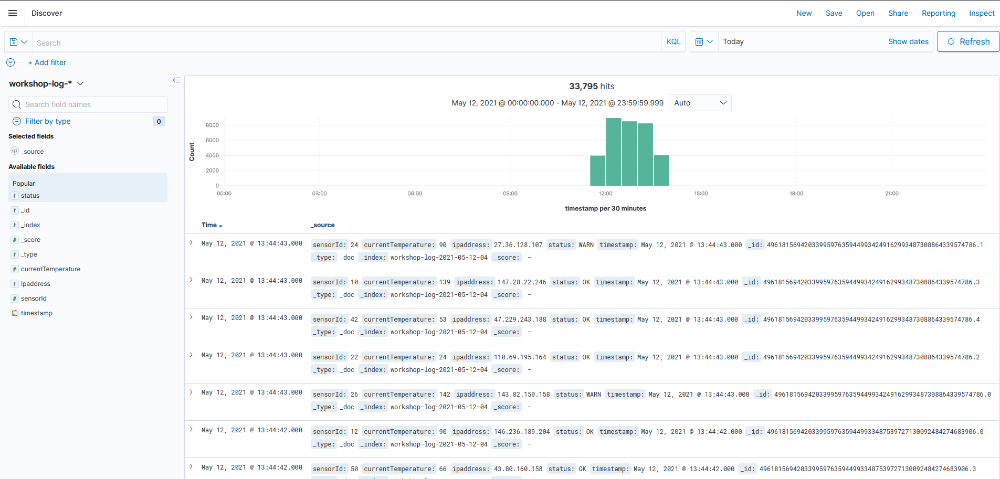
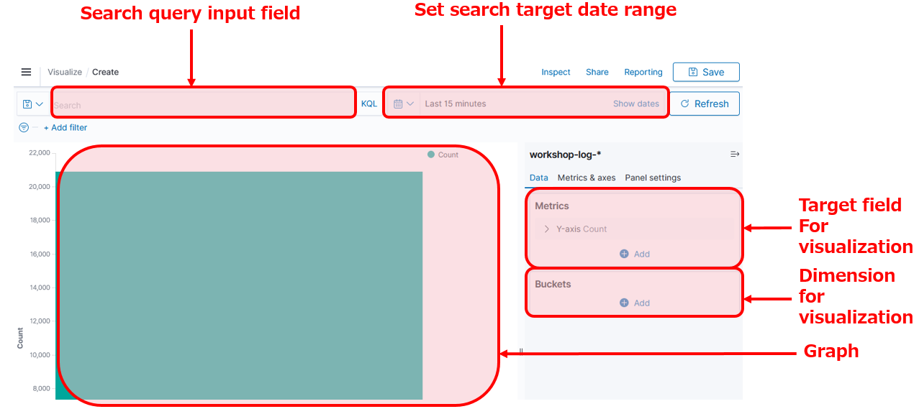

# Lab 2: Visualization and Analytics in Kibana

In this lab, you will use Kibana to visualize and analyze log data generated by Kinesis Data Genrator.

## Section 1: Configuring an Index pattern

### Overview of Kibana

From this section, you basically use Kibana to perform the analysis. Kibana is a web application that allows you to visualize and analyze stream data using Elasticsearch as backend. The following diagram shows the main analysis screen for Kibana.



The icon on the left of the screen is the menu button. The content of each menu are described in order from the top in the list below.

**Kibana**
- **Overview**: This screen is a landing page for Dashboard, Discover and instructions to add data.
- **Discover**: This screen filters the data accumulated in Elasticsearch by a search query and displays a graph of the results. You must first create a dataset for searching, called index pattern.
- **Dashboards**: This screen let you create a dashboard by arranging multiple graphs created in Visualize.
- **Visualize**: This screen let you create a chart component from a dataset.

**Open Distro for Elasticsearch**
- **Query Workbench**: This screen let you search documents with SQL and PPL.
- **Notebooks**: This screen let you create Kibana Notebook. Kibana Notebook offers to create an interactive report.
- **Alerting**: This screen let you configure to send alerts when the data stored in Elasticsearch meet a predifined criteria.
- **Anomaly Detection**: This screen let you manage detector.
- **Trace Analytics**: This screen let you manage dashboards, traces and services generated by Open Telemetry. 
- **Index Management**: This screen let you manage indexes stored in Elasticsearch.
- **Security**: This security management screen let you manage the permission management of users and data.

**Management**
- **Dev Tools**: This development screen allows Elasticsearch to perform operations directly by calling the API.
- **Stack Management**: This screen allows you to manage the index pattern which is a dataset for analysis and also let you configure advanced settings for Kibana.

The main features in the above will be covered in this hands-on. First, after talking about an index, which is a basic collection of data in Elasticsearch, then let’s create an index pattern to be the dataset in analyzing it with Kibana.

### Elasticsearch and Index

Elasticsearch manages data in units called index, which contain multiple documents. The document also contains multiple fields. It's a very easy example, but it would be a good idea to think that it's similar to tables, records, and columns in a typical relational database[^*]. The definition of details, such as what fields the document holds in what format, is called mapping. Defining mapping allows you to control its behaivors in details. On the other hands, even without specifying mapping before inserting data at an undefined index, Elasticsearch automatically creates a mapping based on the content of records. The data from Firehose streams created in Lab 1 leverages this automatic mapping creation.

[^*]: Earlier versions of Elasticsearch had the concept called type that does not exist in the RDB. However, in Elasticsearch 7.0, type is officially deprecated, so that the RDB metaphor seems to be more suitable than before.


Furthermore, Elasticsearch Index has the concept of replicas. The replicas copys index data and storing it in multiple nodes. This concept prevents data loss even in the event of a single node failure. Also they keep data with multiple nodes, you can also improve performance when searching.

### Creating an Index pattern

Now, you will create an index pattern to read the index created in Lab 1.

1. Click  icon icon on the left side of the screen, open **"Stack Management"** menu, and choose **[Index Patterns]** in the left. Then, click **[Create index patterns]** button to open the index pattern creation screen.
1. Enter **"workshop-log-\*"** to **"index pattern"** in **"Step 1 of 2: Define index pattern"**, click **[> Next step]** button. The last \* is called a wild card to use for matching multiple indexes. This time, the log rotation has been set every hour, so different index names such as "workshop-log-2020-04-01-09", "workshop-log-2020-04-01-10", and "workshop-log-2020-04-01-11", are generated every hour. By using wild cards, this index pattern can include all of these in the search.
1. In **"Step 2 of 2: Configure settings"**, choose **[timestamp]** from the pull-down menu of **"Time Filter field name"**. In Kibana, it is a very common use case to visualize data flowing in a stream chronologically. You are specifying the key to aggregate chronological date here. The field named "timestamp" contained in the log format specified in the Kinesis Data Generator in Lab 1 is recognized automatically as date type by Elasticsearch.
1. Click **[Create index pattern]** button to create a new index pattern.

Your preperation has been completed. Now let's take a look at the data.

### Explanation

When adding log data to Elasticsearch for analysis, new data that has just added is accessed frequently, but old data is rarely accessed. Therefore, you may want to archive old data or delete it in some cases. In such case, if all data is put into the same index, to retrieve a specific records, you have to retrieve the whole index then process it one by one. In some operations, such as locking the index overwrite  or replicating data, these operations can only be set per index units, and cannot be set to individual documents.

Therefore, when adding data, we typically change the index of the destination per a certain period of time. When analyzing, we can use the index pattern so that the entire period can be specified. In this workshop, we use the log data a similar format following this convension. For the topic of changing the index setting with the elapsed time, you can try it in Lab 3.

## Section 2: Verifying Data using Discover

In this section, you will explore the data of the Index pattern you have created earlier. Discover is a tool for viewing data in Kibana, so let's try to use it here. The screen description of Discover is as follows.


### Data Visualization with Discover
1. Click  icon icon on the left side of the screen, and open **[Discover]**.
1. Choose **[workshop-log-*]** from the pull-down menu in the Index pattern on the left of the screen, a bar chart is displayed. Make sure that the Document is lined up in below. In addition, click the calendar button in the top right of the screen to specify the time to search, and click **[Today]** in **"Commonly used"**. It displays all of the logs for the day. You can change the display and search scope by changing the values here.
1. At the content of Document, you can see that the fields such as sensorId, currentTemperature, Ipaddress. starus, and timestamp, same as the template to specified in Lab1 are also displayed here. Meanwhile, some fields are not specified, such as _id, _type, _index, and _score. These are the metadata that Elasticsearch adds automatically.
   
1. Enter `status:WARN` in the search field at the top left of the screen, and click **[Update]** button in the right. This input works as a filter criterion so that only Document displayed on the screen is in the WARN status, and the WARN is highlighted. Also, Document for FAIL or WARN is displayed by entering `status:FAIL|WARN`.
1. Try to do **[Update]** by entering `currentTemperature>100`. You can filter records only with a temperature of 100 degrees or higher. Also, you can combine multiple conditions. By filtering such as `currentTemperature>100 and status:WARN`, you can search records only with a temperature of 100 degrees or higher and WARN. You can also search by combining OR conditions such as `(currentTemperature > 120 and status:WARN) or sensorId: 10`. Then, you can filter records only with the IP address starting with 1 by using `ipaddress:1*`. Please try various search criteria.
1. Click **[status]** in the Field list on the left in this state. For each WARN, OK, and FAIL including this Field, the ratio of each item in the search result will be displayed. Note, however, that this value is an approximate value, not a whole quantity.

## Section 3: Creating Graphs with Visualize

Now, you will try creating a graph here. Kibana has a graphing and drawing tool called Visualize. However, to use the Visualize feature, you need to understand Elasticsearch terminology. The idea of graphing will be explained using several graph drawings here. The below shows you the description of Visualize screen.



### Visualizing a ratio of OK, WARN, and FAIL status

First, we will create a pie chart to visualize a ratio of OK, WARN and FAIL status of all records.

1. Click  icon icon on the left side of the screen, and open **[Visualize]**. Next, click **[+ Create new visualization]** button to go to the graph creation screen. Select **[Pie]** from the pop-up menu. Then, move to the data source selection screen, and open the graph creation screen by choosing **[workshop-log-*]**.
1. In the menu on the right of the screen, confirm **"Metrics"**. You can see **"Count"** displayed in **[Slice size ]** here. This indicates that the aggregation target of the graph is the number of records. You can change the aggregation target by clicking **[Slice size]** to display the details menu. There is no need to do anything because the number of records is as it is.
1. Move onto **"Buckets"** and click **[+ Add]** button. There are two menus here. Choose **[Split Series]**. This adds an axis to aggregate values on a single chart. Note that if you choose **[Split Chart]**, you will create the same numbers of the graphs as the number of categories of metrics you selected. The graph that has as much as categories of metrics you have chosen will be created.
1. Let's look at the steps to add the status to the axis to aggregate value here. Choose **[Terms]** in **"Aggregation"**. We typically use this Terms to add an axis for the category type field such as status. Then, add **[status.keyword]** in **"Field"**.
1. Once you could set this up, click **[▷ Update]** button on the right side of the screen to reflect the changes. The following graph will be displayed. When you hover your cursor over the graph, the ratio of each item will be displayed. The chart can be adjusted in details from **[Options]** tab at the top of the right menu.
   ]
1. At last, give the graph a name and save it. Click **[Save]** button in the top right of the screen, give a name **"Percentage of Status"** for **"Title"**, and click **[Save]**. After completed saving, click the **[Visualize]** link in the top left of the screen, and go back to the top page of Visualize menu. Now, you can see that the graph you have created is displayed in the list.


### Explanation: Data Type of Elasticsearch

The term called status.keyword is mentioned in the graph creation you have just completed. Let’s take a closer look at what this keyword is.

To understand this keyword, you need to understand the way of handling the Elasticsearch data using behind Kibana. The basic data types of Elasticsearch are shown as follows. For more information of other than data types below, see the[Elasticsearch documentation](https://www.elastic.co/guide/en/elasticsearch/reference/current/mapping-types.html). In fact, for Elasticsearch, there are two types of strings that are represented as text and keyword. The text type stores a regular string and is used for normal full-text search purposes, such as returning a high match score for a search query. On the other hand, the keyword type is used for text types that have semantic meaning as a whole string, such as an email address or a website URL.

| **Data Type** | **Description** |
| ---------------- | ------------------------------------------------------------ |
| text | String type, which is split into words and stored in index. |
| keyword | String type, which is not split, and the entire text is stored as is in index. |
| numeric | Numeric type, which is including long, float, integer, etc. |
| date | Date type |
| date nanoseconds | Date type including up to nanoseconds. |
| boolean | Boolean type |
| binary | Binary type |
| range | Range type, which represents a range of numbers or dates. |

If data is inserted into Elasticsearch without predefined index mapping, Elasicsearch will automatically create the two fields, text and keyword, for strings. The default is text type, and the keyword type is defined with .keyword appended to the field name. This status.keyword indicates the field of the keyword type. When grouping like this, you must use a field of keyword type instead of type text according to the Elasticsearch specification. So here's the status.keyword is used.

Then, let’s take a close look at the word Term. When working with Kibana, an aggregate query for Elasticsearch is sent on the backend. The following query is sent to Elasticsearch, when aggregating data based on string in such situation like this lab. The terms used in the query below refer to Term on Kibana. Sometimes unfamiliar Elasticsearch terms appear when visualizing in Kibana, but you can get used to them after a while.

```
GET /workgroup-log/_search
{
  "size": 0,
  "aggs": {
    "group_by_status": {
      "terms": {
        "field": "status.keyword"
      }
    }
  }
}
```

### Chronological change of FAIL/WARN numbers by temperature

Now, let’s create a chronological graph. By dividing data into multiple groups by sensor temperature, let's visualize the number of abnormal records.

1. Click  icon icon on the left side of the screen, and open **[Visualize]**. Next, click **[ + Create new visualization]** button to go to the graph creation screen. From the pop-up menu, choose **[Area]**. Then, move to the data source selection screen to open the graph creation screen by choosing **[workshop-log-*]**.
   ]
1. Enter `status:WARN|FAIL` in the search window at the top left of the screen. Next, click a calendar icon at the right side of the search window. Then set date range to **[1]** **[Hours ago]**, and click **[Apply]** button. This allows you to change the time zone displayed on the screen. 
   Then, Click **[▷ Update]** button on the right side of the screen to reflect the changes. Now you can perform the aggregation that is filtered to records with abnormal status.
1. Click **[+ Add]** button and choose **[X-Axis]** in **"Bucket"**, and then choose **[Date Histogram]** from **"Aggregation"**. This adds information of date and time to the X axis, that is, the horizontal axis. By clicking **[▷ Update]** button on the right side of the screen, changes you made are applied, and the following graph will be displayed.
   
1. Click **[Add sub-buckets]** button at the bottom of the right menu to set additional axes. Next, choose **[Split Chart]**, and display a separate graph for each temperature range. Then, choose **[Range]** from **"Sub Aggregation"**. Let's divide the temperature range of IoT sensors into three things such as low, high, and ultra-high temperature here. Choose **[currentTemperature]** from **"Field"**, click **[Add Range]** button once, and enter  **"0"** - **"29"**, **"30"** - **"59"**, **"60"** - **"999"** in **"From"**, **"To"**. Then, click **[Columns]** directly below the **"Split Chart"**. This allows you to choose whether the split graph is displayed vertically or horizontally. **[Rows]** displays the graph vertically, and **[Columns]** displays the graph horizontally. In this case, it is better to choose the graph horizontally, so that we can compare how many abnormal records are in each temperature range. When you have completed here, click **[▷ Update]** on the right side of the screen again to apply the changes, and the following graph will be displayed.
   

1. Save the graph you have created by giving it a name. Click **[Save]** button in the top right of the screen, give it a name **"Abnormal Status Trend by Temperature Range"** in **"Title"**, and click **[Save]**.

### Creating Additional Charts

In a similar manner, create a few graphs to check regularly on the dashboard. First, divide the IP range into Private IP band and others so that you can check the date and time variation of average values for the temperature obtained from each sensor.

1. Click  icon icon on the left side of the screen, and open **[Visualize]**. Next, click **[ + Create new visualization]** button to go to the graph creation screen. From the pop-up menu, click **[Line]**. Then, move onto the data source selection screen to open the graph creation screen by choosing **[workshop-log-*]**.
1. Click **[Y-Axis]** in **"Metrics"** to open the details, and choose **[Average]** from **"Aggregation"**. Then, choose **[currentTemperature]** in the **"Field"** below.
1. Choose **"X-Axis"** from **"Buckets"**, and then choose **[Date Histogram]** from **"Aggregation"**. This adds the information of date and time to the X axis.
1. Click **[Add sub-buckets]** button at the bottom of the left menu to set additional axes. Then choose **[Split Series]**, and choose **[Filters]** from **"Sub Aggregation"**. The private IP range here uses the commonly used 10.0.0.0-10.255.255.255 and 192.168.0.0-192.168.255.255, enter `ipaddress:10.* or ipaddress:192.168.* ` in **“"Flter 1"**, then click the button like a tag in the top right of the entry field. **"Filter 1 label"** is displayed, so enter **"Private IP"**. In a similar manner, click [Add Filter] to add `*` in **"Flter 2"**. By clicking **[▷ Update]** button on the right side of the screen, the changes will be reflected as follows.
   
1. Click **[Save]** in the top right of the screen, give a name **"Private IP Access Trend"** in **"Title"**, and click **[Save]**. You can now view the total number of records.

At last, create a chart that counts the number of simple records.

1. Click  icon icon on the left side of the screen, and open **[Visualize]**. Next, click **[+ Create visualization]** button on the top right of the screen to go to the graph creation screen. From the pop-up menu choose **[Metric]**. After moving onto the data source selection screen, the graph creation screen will open by choosing **[workshop-log]**.
1. Click the calendar button in the field that specifies the time range in the top right of the screen, and choose **[Today]** from **"Commonly Used"**. Then, click **[Save]** in the top right of the screen, give it a name **"Today's Total Record Count"** in **"Title"**, and click **[Save]**. You can now view the total number of records.

## Section 4: Creating a dashboards with Dashboards

In this section, view the graphs created in the previous section into a single dashboard.

1. Click  icon icon on the left side of the screen, and open **[Dashboard]**. Next, click **[+ Create new dashboard]** button in the center of the screen.
1. After moving onto the edit screen, click **[Add an existing]**, and add the graph. The four graphs you have created so far are displayed in the list. Click them in order, and add them all to your dashboard. After completing, click **[X]** button in the top right to go back to the previous screen.
1. After that, you can choose, move, and resize the graph as you like. For example, you can display a dashboard in the following form.
   
1. After completing to edit the dashboard, click **[Save]** button in the top right corner of the screen to save it with the title **"IoT Sensor Metrics Dashboard"**. You can now view your dashboard at any time.

## Summary

In Lab 2, you used Kibana to visualize data. This makes it easy to search in different conditions and create real-time dashboards using different axes aggregating data. In the next [Lab 3](../lab3/README.md), let's conduct operational management using features of Elasticsearch & Kibana.