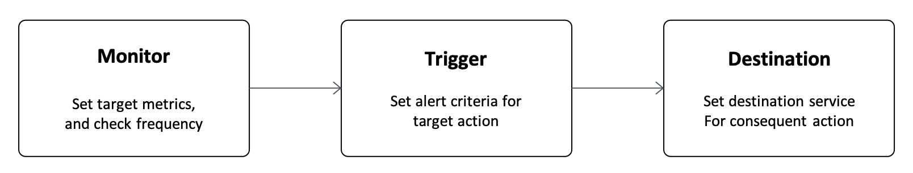
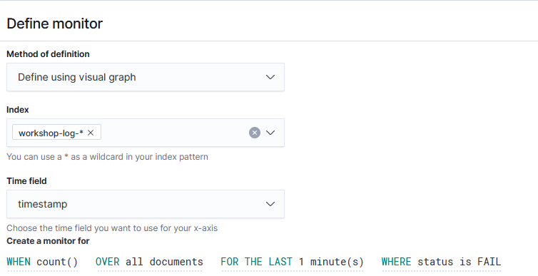

# Lab 3: Operational Management of Amazon ES

In the previous Lab, you have been trying out with the basics of using Kibana, such as creating and analyzing visuals of Kibana In this lab, you will try out with some operational managements, such as permission management, alerts, and index management.

## Section 1: Amazon ES Permissions Management

When you have set up Amazon ES in Lab 1 and logged in to Kibana, user authentication with a user name and password were required. In this lab, the master user account was used to login. However, a mere user can't usually use the same master account to perform analyses in Kibana. The correct method is to create a separate account for each user and grant only limited permissions that match the user's role.

So in this section, it assumes that you are a user of the IoT department and publish the dashboard you have created to those users. In addition, among users of the IoT department, you will separate their permission between developers with write permission and viewers with read-only permission, and set a content boundary for each of them.

### Creating tenants and copying data

First, you will create a space to open only to users of the IoT department in Kibana. Amazon ES uses the concept of tenants which is the scope to publish to a limited number of people. By default, there are Private tenants that only the user who created them can access, and Global tenants that are shared by all users. Let's add new tenants here for the IoT department.

1. Click  icon on the left side of the screen, and open **[Security]**.
2. Click **[Tenants]** on the left side of the screen to go to the screen to edit tenants. Then, click **[Create tenant]**  button on the right of the screen to create a new tenant.
3. Enter **"IoT"** in **"Name"**, and click **[Create]**.

Next, export existing index patterns, visuals, and dashboard data.

1. Click  icon on the left side of the screen, and open **[Stack Management]**. Then, click **[Saved Objects]** in the left.
2. A list of index patterns, visuals, and dashboards created in Lab 2 are displayed on the screen. Check all of these items, and click [Export] in the top right. A JSON file containing these settings will be downloaded.

Then, switch the tenant and copy the data.

1. Click user icon on the right corner of the screen, and click **"Switch tenants"**.
1. Choose **"Choose from custom"** at **"Select your tenant"** dialog, choose **"IoT"**, and click **[Confirm]** button to switch tenants.
1. Click  icon on the left side of the screen, and open **[Stack Management]**. Then, click **[Saved Objects]** in the left.
1. Click **[Import]** button in the top right of the screen to choose the JSON file in the above and upload it. The dashboard and visuals mentioned in the earlier are now copied to your screen.

### Creating a new Amazon ES role

Now, you will create a role that is set of Amazon ES permissions to assign to users for the IoT department. The two types of roles will be created here for developers with write permission and for viewers with read-only permission. First, create a role for developers.

1. Click  icon on the left side of the screen, and open **[Security]**.
1. Click **[Create new Role]**  on **[Get started]** screen.
1. Enter **"iot_developer_role"** in **"Name"**.
1. Enter **"workshop-log-*"** including the index name designated in Firehose earlier in **"Index"** in **[Index permissions]** section. Then, add  **"crud"** to **"Index permissions"**.
1. Click **[Create]** button at the bottom of the screen to create the role.

In a similar manner, create roles for viewers.

1. Click  icon on the left side of the screen, and open **[Security]**.
1. Click **[Create new Role]**  on **[Get started]** screen.
1. Enter **"iot_reader_role"** in **"Name"**.
1. Enter **"workshop-log-*"** including the index name designated in Firehose earlier in **"Index"** in **[Index permissions]** section. Then, add  **"read"** to **"Index permissions"**. Then, enter the following string for **"Document Level Security Query"**. This is an Elasticsearch query to display only workshop-log data which has OK in status field. At last, add **"ipaddress"** in  **"Anonymization"**. The following shows the configuration.
   ```json
   {
     "bool": {
       "must": {
         "match": {
           "status": "OK"
         }
       }
     }
   }
   ```

   

1. Add **"IoT"** to **"Tenant"** in "**Tenant permissions** section", and choose **[Read Only]** from the pull-down menu on the right side of **"Tenant"**.
1. Click **[Create]** button at the bottom of the screen to create the role.

### Setting up Kibana users and mapping roles

Now, you will create a user to log in to Kibana.

1. Click  icon on the left side of the screen, and open **[Security]**.
1. Click **[Create internal user]**  on **[Get started]** screen.
1. Enter **"iot_developer"** in **"Username"** and the appropriate string in **"Password"** and **"Repeat Password"**, and then click **[Create]**.
1. In a similar manner, create browsing users as well. Click **[Create internal user]** button in the top right of the screen to open the new user creation screen. Enter **"iot_reader"** in **"Username"** and the appropriate string in **"Password"** and **"Repeat Password"**, and then click **[Create]**.

At last, associate the created user with the role you have prepared earlier.

1. Click  icon on the left side of the screen, and open **[Security]**.
1. Click **[Roles]** on the left side of the screen to open a role list.
1. Choose **"iot_developer_role"** from the roll list.
1. Open **[Mapped users]**, and click **[Manage mapping]** button.
1. Choose **"iot_developer"** from the pull-down menu of **"Users"**, and click **"Map"** button.
1. For the viewer, in a similar manner, map **"iot_reader_role"** role to **"iot_reader"** user.
1. In addition, to use the Kibana UI, you must grant both developers and viewers a predefined kibana_user role on Amazon ES. Map **"kibana_user"** role to **"iot_reader"** user and **"iot_developer"** user.

Now, you have completed the tasks of tenants creation, roles and users creation and the mapping. Then, let's try logging in as the user you have created, and then make sure that the permissions are working as expected.

### Log in as the user you created and check the permissions

First, you will log in with iot_developer.
1. Click user icon on the right corner of the screen, and click **"Log out"** to log out from Kibana. Go back to the login screen, and log in with the iot_developer account you have created.
1. You can confirm that there is no **"Security"** item in the left menu of the screen after logging in. The iot_deveoper user cannot access this menu because it does not have the administrator credential.
1. Click user icon on the right corner of the screen, and switch tenant to **"IoT"**.
1. Make sure you have access to such as Discover, Visualize, and Dashboards, and you can search and create visuals.

Next, you will try logging in with iot_reader.

1. Click user icon on the right corner of the screen, and click **"Log out"** to log out from Kibana. Go back to the login screen, and log in with the iot_developer account you have created.
1. Click user icon on the right corner of the screen, and switch tenant to **"IoT"**.
1. Open the Discover page, adjust the time range of the target data appropriately, and display the data. You can see that the ip_address column is hashed as follows. This is because the ipaddress column was specified in the anonymized fields of iot_reader_role you have created earlier.
   
1. Also, when you open the Dashboards page, you can see that “Percentage of Status” is OK as shown below. This is because it was set to be able to view only that the status column has OK. Also, because the IP address is hashed, Private IP and other time sequence transitions are not displayed in the graph.
   

Once you have completed this confirmation, log out of iot_reader, and then **log back in to Kibana as the master user created in Lab1**. It is mandatory to proceed with Section 2 or later.

## Section 2: Sending Alerts to Amazon SNS

Amazon ES offers more functionality than just visualizing data using dashboards. When a certain data exceeds the predefined criteria, it can send the notification and prompt you to respond too. For example, if you are collecting logs from your equipments, you may want to send an alerting email to the administrator when the status of the error was recorded more than a predefined time. Therefore, let's try to send the notification to the SNS topic set in Lab 1 here.

The mechanism of alerts on Amazon ES as follows. In this example, you will monitor the number of FAIL statuses in the log in the metric every minute. Here, if you receive more than one log with FAIL status in a minute, you can send an alert email via SNS topic as an action.



### Destination Settings

First, set the destination of the action. Here, specify the SNS topic created in Lab 1 as the destination.

1. Choose **"Alerting"** item on the left of the screen to open the Alerting menu.
1. Choose **[Destinations]** tab from the menu, and click **[Add destination]** button.
1. Enter **"Amazon ES alert topic"** in **"Name"**. Choose **[Amazon SNS]** from the **"Type"** pull-down menu. Enter SNS topic you have created in Lab 1 and IAM role ARN to **"SNS Topic ARN"** and **"IAM role ARN"** in **"Settings"**.
   - **SNS Topic ARN**: The string should be look like `arn:aws:sns:ap-northeast-1:123456789012:amazon_es_alert`
   - **IAM role ARN**: The string should be look like `arn:aws:iam::123456789012:role/amazones_sns_alert_role`
1. Click **[Create]** button.

### Monitor Settings

Now, you will set the metrics and frequency for monitoring in the Monitor function. Here, you will count the number of FAIL in the status field in the log, once per minute.

1. Choose **"Alerting"** item on the left of the screen to open the Alerting menu.
1. Choose **[Monitors]** tab from the menu, and click **[Create monitor]** button on the right.
1. After opening the Monitor creation screen, enter **"FAIL status monitor"** in **"Monitor name"**. Then, enter **"workshop-log-*"** in **"Index"** within **"Define monitor"**, and choose **[timestamp]** as **"Time field"**. Then, set `WHEN count() OVER all documents FOR THE LAST 1 minute(s) WHERE status is FAIL ` to the query of  **"Create a monitor for"**. After setting it all, you can see as follows.
   
1. Click **[Create]** button to create a Monitor. After creating a Monitor, move to the Trigger creation screen.

### Trigger Settings

Now, you will set up Trigger. Here, you assume that you want to alert if there is more than one FAIL status.

1. Enter **"FAIL count trigger"** in **"Trigger name"**.Set **[3]** for **"Severity level"**. Then, set `IS ABOVE 1` in **"Trigger condition"**．This triggers the alert when it is raised more than 1, that is 2 times.

1. Go to **"Configure actions"** at the bottom. Enter **"Too many FAIL notifications"** in **"Action name"**. From the “Destination” pull-down menu, choose **[Amazon ES alert topic - ( Amazon SNS)]** you have created. Then set **"The record number of FAIL status exceeds over that the threshold"** to **"Message subject"**.

1. Replace “Message” with the following content by deleting the first message.

   ```
   An alert was detected on the monitor item {{ctx.monitor.name}}.Please check the status.
   - Trigger: {{ctx.trigger.name}}
   - Severity: {{ctx.trigger.severity}}
   - Aggregation start time: {{ctx.periodStart}}
   - Aggregation end time: {{ctx.periodEnd}}
   ```

1. Click **[Create]** button to create the Trigger.

Then, the setting for Trigger has been completed.

### Reviewing Results

You can see that the history of the alert is displayed in History when you open the FAIL status monitor page.


After a few minutes, an alert message will be sent to the set email address and Triggered will be displayed in the alert history.


When alerting, the alert is displayed in the list on **[Dashboard]** tab. After checking the check box on the left, and you can stop the alert by clicking **[Acknowledge]** button. However, if a similar situation occurs, a new alert will be raised and emails will continue to be sent. So when you are completed reviewing, choose the check box for the created Monitor from **[Monitors]** tab, and click **[Disable]** in **[Actions]** button.

## Section 3: Managing Index

As described in Lab 1 and Lab 2, Amazon ES data is basically managed by index units. In this workshop, when inserting logs from Firehose, the index name of the destination is changed periodically. In a log analysis use case like Lab 2, recent data is usually processed frequently. However stale data saved long time ago rarely get any access.

If a new index is created every hour like this lab, a large amount of disk space is demanded to store a large number of old indexes that rarely get access. Naturally, old index are configured to deleted automatically. Also, if large amount of access hit a server, the index size may increase. This may affect the performance of the analysis. In such case, you can create a new index automatically when it exceeds a certain size. And writing to the new index would be stable the operation of Amazon ES.

Amazon ES has Index State Management feature which enables sthe index management as described. Now, let’s apply a setting that automatically deletes the log after 7 days after the index is generated.

### Creating Index Policy

The JSON format configuration file describing the operation rules is called index policy in Amazon ES. You will create an index policy that automatically deletes the index in 7 days passed after the index is created.

1. Choose **"Index Management"** item on the left of the screen to open the Index Management menu.

1. Choose **[State management policies]** menu from the left menu, and click **[Create policy]** button on the right.

1. Enter **"delete_after_1week"** in **”Policy ID"**.

1. The default policy is already entered, but you will not use it at this time. Copy and paste the following contents into **"Define policy"**. The below are simple statements. It is self-descriptive and you should be able to understand the content.

   ```json
   {
       "policy": {
           "description": "Delete index 1 week after.",
           "default_state": "live",
           "states": [
               {
                   "name": "live",
                   "actions": [
                       {
                           "read_write": {}
                       }
                   ],
                   "transitions": [
                       {
                           "state_name": "delete",
                           "conditions": {
                               "min_index_age": "7d"
                           }
                       }
                   ]
               },
               {
                   "name": "delete",
                   "actions": [
                       {
                           "delete": {}
                       }
                   ],
                   "transitions": []
               }
           ]
       }
   }
   ```

1. Click **[Create]** button to create the policy.

### Apply Index policy to an existing index

Now, you will apply the policy you created to an existing index.

1. Choose **"Indices"** in the left menu. From the list of index, choose the index sucn as **[workshop-log-2020-04-01-09]** (the date part contains different values depending on the time of the workshop.), check the check box on the left, and then click **[Apply policy]** button on the top left.
1. When the pop-up menu is displayed, choose  **"delete_after_1week"** you have created, and click **[Apply]** button.
1. You can see the policy is applied to the index when choosing **[Policy managed indices]** on the left menu.

### Apply Index policy to future indexes (for Elasticsearch 7.10 or later)
Using the method above, you can apply a policy to an existing index, but you cannot set it to a new policy in advance. It is hard to set this manually every time an index is created. So improve the configuration, so that the policy is automatically applied.

1. Choose **"Index Management"** item on the left of the screen to open the Index Management menu.
1. Choose **[State management policies]** menu from the left menu, and open **delete_after_1week** policy.
1. Click **[Edit]** button at dialog.
1. Update policy as follows. Difference is with **"ism_template"** section or without.

   ```json
   {
       "policy": {
           "description": "Delete index 1 week after.",
           "default_state": "live",
           "states": [
               {
                   "name": "live",
                   "actions": [
                       {
                           "read_write": {}
                       }
                   ],
                   "transitions": [
                       {
                           "state_name": "delete",
                           "conditions": {
                               "min_index_age": "7d"
                           }
                       }
                   ]
               },
               {
                   "name": "delete",
                   "actions": [
                       {
                           "delete": {}
                       }
                   ],
                   "transitions": []
               }
           ],
           "ism_template": {
               "index_patterns": ["workshop-log-*"],
               "priority": 100
           }
       }
   }
   ```
1. A new index can only be created once an hour, so let's create a new index manually. Leave the contents of **"Console"** as it is, leave one line free to copy the following codes, and then click ▶︎ button.

   ```json
   POST workshop-log-policy-test/1
   {
     "id": "test"
   }
   ```

1. To confirm that the policy is actually applied to the new index, copy the following codes, and then click ▶︎ button. You can also confirm it from **"Index Management"** screen. 

   ```
   GET _opendistro/_ism/explain/workshop-log-policy-test
   ```
  
1. When the following are displayed, you have successfully applied a policy to a new index.

   ```json
   {
       "workshop-log-policy-test" : {
        "index.opendistro.index_state_management.policy_id" : "delete_after_1week",
        "index" : "workshop-log-policy-test",
        "index_uuid" : "xtMovQxUR7qlk0qToBodYw",
        "policy_id" : "delete_after_1week",
        "enabled" : true
        },
        "total_managed_indices" : 1
   }
   ```

### Apply Index policy to future indexes (for Elasticsearch 7.9 or earlier)
For Elasticsearch 7.9 or earlier, you need to call Elasticsearch API directly to apply this configuration. You can use a UI called Dev Tools to call this API.

1. Choose **"Dev Tools"** item on the left of the screen.

1. Leave the contents previously written in **"Console"** below, leave one line free, and copy the following codes below it. This means that **"delete_after_1week"** policy is applied automatically when it is created for all indexes applied to **"workshop-log-*"**.

   ```json
   PUT _template/index_policy_templete
   {
     "index_patterns": ["workshop-log-*"],
     "settings": {
       "opendistro.index_state_management.policy_id":  "delete_after_1week"
     }
   }
   ```

1. Click ▶ ︎button on the right of the copied command, and execute the API. When the following result is displayed on the right screen, it is successful.

   ```json
   {
     "acknowledged" : true
   }
   ```

   

1. A new index can only be created once an hour, so let's create a new index manually. Leave the contents of **"Console"** as it is, leave one line free to copy the following codes, and then click ▶︎ button.

   ```json
   POST workshop-log-policy-test/1
   {
     "id": "test"
   }
   ```

1. When the following are displayed, you have successfully created a new index.

   ```json
   {
     "_index" : "workshop-log-policy-test",
     "_type" : "1",
     "_id" : "Hsi7qnABvXnwMeRuRS2W",
     "_version" : 1,
     "result" : "created",
     "_shards" : {
       "total" : 2,
       "successful" : 1,
       "failed" : 0
     },
     "_seq_no" : 0,
     "_primary_term" : 1
   }

   ```

1. To confirm that the policy is actually applied to the new index, open **"Index Management"** menu on the left of the screen to open the Index Management menu.

1. When choosing **[Managed Indices]** from the left menu, you can confirm that the policy is applied to the index and it is in the Initializing status. This policy will be applied to newly created indexes with the **"workshop-log-*"** format from now on.
   

This concludes the description of managing index. In this time, very simple policy was created. You can actually set a wider range of policies. Please click [here](https://docs.aws.amazon.com/ja_jp/elasticsearch-service/latest/developerguide/ism.html) for more information.

## Summary

In Lab 3, you have completed to try out various features involving managing Amazon ES operations. Now, you know that you can easily manage many features. Let's move onto to the next [Lab 4](../lab4/README.md), and learn more advanced features of Amazon ES.