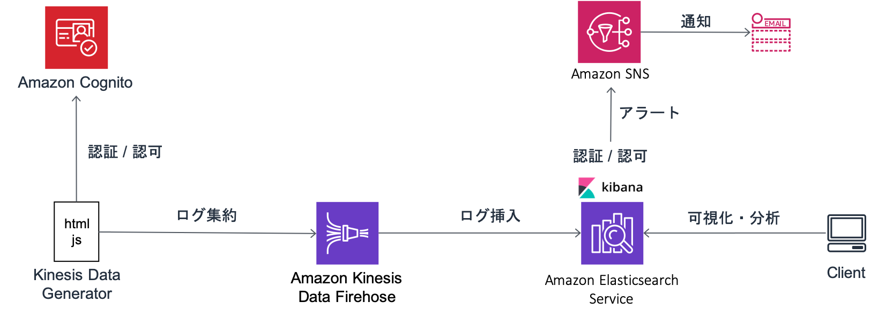

# はじめに

## 本ワークショップのゴール

Amaon Elasticsearch Service（Amazon ES）は，オープンソースの全文検索エンジン Elasticsearch を，安全かつスケーラブルな形で提供するマネージドサービスです．Amazon ES は主に以下の 2 つの用途で，多くのお客さまに使われています．

- ストリームデータに対するリアルタイムダッシュボードやログ分析
- 主にテキストデータを対象とした全文検索

本ワークショップでは，Amazon ES および関連する AWS サービス群を用いて，実際にリアルタイムダッシュボードの構築および全文検索を行うことを通じて，Amazon ES の使い方を理解し，今後の活用に役立てていただくための足がかりとすることをゴールとします．

## 準備事項

- AWS を利用可能なネットワークに接続された PC（Windows, Mac OS, Linux 等）
- 事前に用意していただいたAWSアカウント
- ブラウザ（Firefox もしくは Chrome を推奨）

## ワークショップの概要

本ワークショップを通じて，以下のような仕組みを構築していきます．

ワークショップは，以下の 4 つの Lab から構成されています．下記リンクを辿って，Lab 1 から順番に進めていってください．またワークショップを終える前に，かならず[後片付け](cleanup/README.md)を行なってください．そうしない場合には，継続的な課金が発生してしまいます．

- [Lab 1](lab1/README.md): 環境のセットアップ
- [Lab 2](lab2/README.md): Kibana での可視化と分析
- [Lab 3](lab3/README.md): Amazon ES の運用管理
- [Lab 4](lab4/README.md): 日本語文書の全文検索

## ハンズオン全体を通しての注意事項

- 本ハンズオンは，基本的に「東京リージョン」を前提に記載されています．リソースなどの上限に引っかかってしまった場合は，「バージニア北部リージョン」で環境を作成することもできます．その場合，各ハンズオン資料の「東京リージョン（ap-northeast-1）」の記載をすべて，「バージニア北部（us-east-1）」に読み替えてください
- 同じ AWS アカウントで，複数人が同時に本ハンズオンを実施する場合、リソースの名前などが重複しないように注意してください
- 各手順において「任意」と記載のあるものについては，自由に名前を変更いただくことができますが，ハンズオン中に指定した名前がわからなくなったり，混乱したりしないように，基本的にはそのままの名前で進めることを推奨します
- 手順内に「解説」と書かれている箇所については，ハンズオンで扱っている内容についての細かな説明となります．読み飛ばしていただいても，ハンズオンを進める上では特に問題はありません．ですがこの欄には，技術的な背景やハンズオンの中身についての説明が書かれていますので，読んでいただくことで理解を深められます

