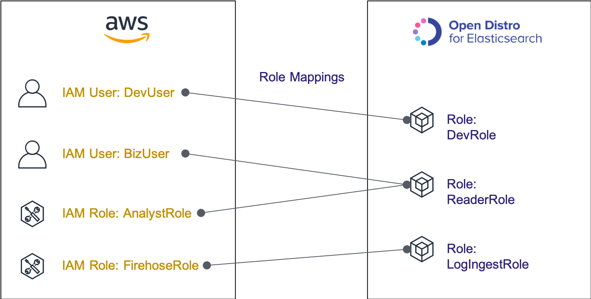
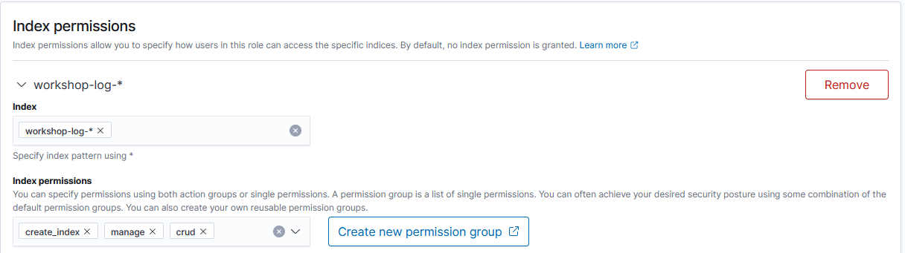
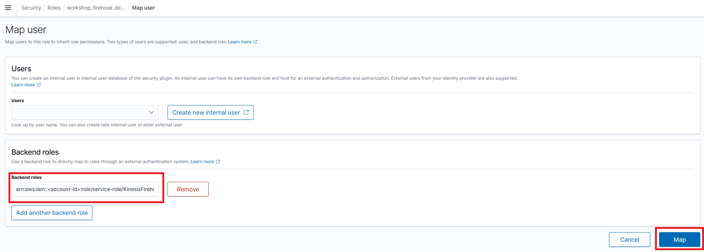

# Lab 1: 環境のセットアップ

この Lab では，他の Lab で必要となる環境のセットアップを行います．この章で構築するシステムの全体像は以下の通りです．


このシステムでは，Kinesis Data Generator という JavaScript ベースのツールを用いて分析用のログを生成します．このツールでは，ログを送信するための認証/認可を，Amazon Cognito というサービスを用いて行います．その上で Generator から所定フォーマットのログを，Amazon Kinesis Firehose（以下 Firehose）というログ集約サービスに送ります．Firehose に送られたデータは，指定した間隔でデータをまとめて Amazon Elasticsearch Service（以下 Amazon ES）に書き込まれます．Amazon ES には Kibana と呼ばれる，ブラウザベースの可視化・分析ソフトウェアが同梱されています．この Kibana を用いて，ブラウザから実際にログの可視化・集計処理を行っていきます．また Amazon ES でデータの監視を行い，問題が起きた場合には，Amazon Simple Notification Service（以下 Amazon SNS）という通知サービスに対してアラートを飛ばします．

## Section 1: Amazon ES のドメイン作成

まずは，Amazon ES のドメインを作成します．Amazon ES では，Elasticsearch クラスターのことをドメインと呼びます．ドメイン作成の処理を行うと，裏で新しく仮想マシンが立ち上がり，Elasticsearch クラスターのセットアップが始まります．


### Amazon ES のドメイン作成

1. AWS マネジメントコンソールにログインします．ログイン後，画面右上のヘッダー部のリージョン選択にて， **[東京]** となっていることを確認します．もし **[東京]** となっていない場合は，リージョン名をクリックして，**[東京]** に変更してください
1. AWS マネジメントコンソールの画面左上にある [サービス] を押してサービス一覧を表示させ，**[Elasticsearch Service]** を選択してください（画面上部の検索窓に **"elasticsearch"** などと打ち込むことで，サービスを絞り込むことが可能です）．Elasticsearch の画面を開いたら **[新しいドメインの作成]** ボタンを押して，ドメイン作成画面に進みます
1. **"Step 1: デプロイタイプの選択"** において，**"デプロイタイプの選択"** で **[開発およびテスト]** を選択します．バージョンは変更せず，そのまま **[次へ]** を押してください
1. **"Step 2: ドメインの設定"** で，**"Elasticsearch ドメイン名"** に **"workshop-esdomain"** と入力します．それ以外の箇所は変更せずに **[次へ]** を押してください
1. **"Step 3: アクセスとセキュリティの設定"** で，**"ネットワーク構成"** を **[パブリックアクセス]** に設定します．続いて **"細かいアクセスコントロール"** で，**[マスターユーザーの作成]** を選択してください．ここで設定マスターユーザーのアカウントは，Amazon ES 上の可視化ツール Kibana にログインするために使われます．インストラクションに従って任意の **マスターユーザー名** および **マスターパスワード** を入力してください．マスターユーザー名は 1-16 文字の間で設定する必要があります．またマスターパスワードは 8 文字以上，かつ大文字，小文字，数字，および特殊記号をそれぞれ一つずつ含む形で入力してください．ここで設定したユーザー名，パスワードは Section 3 で使用します
1. 次にアクセスポリシーの項目を設定します．[こちら](http://checkip.amazonaws.com/)にアクセスして，自身の IP を確認してください．続いて **"ドメインアクセスポリシー"** で **[カスタムアクセスポリシー]** を選択し，その下の項目で **[IPv4 アドレス]** を選びます．その右の空欄に，先ほど確認した自身の IP をそのまま入力し，その右を **[許可]** に設定します．ここまで設定したら，画面一番下の **[次へ]** を押してください
   
1. **"Step 4: タグの追加 - オプション"** では，必要に応じてタグの追加を行い **[次へ]** を押してください
1. **"Step 5: 確認"** で，これまでの設定内容を眺めて，特に問題がなければ画面右下の **[確認]** を押してドメインを作成してください．ドメイン作成には 15 分程度かかりますので，その間に次の Firehose ストリーム作成に進みます

### 解説: Amazon ES について

今回のハンズオンでは，あくまでお試しということで 1 台だけで Elasticsearch を立てています．ですが本来，Elasticsearch は複数台のマシンでクラスターを組むことで，大規模データを扱ったり，高い可用性を得たりできるものです．そこで本番運用する際の Amazon ES では，クラスターの管理を行う専用のマスターノードを複数台，また実際のデータを格納するデータノードも複数台用意します．

Amazon ES における典型的な Easticsearch クラスターの構成は，以下のものになります．AWS リージョンにある 3 つ以上の Availability Zone（以下 AZ）にノードを分散させて，どこかひとつの AZ で障害が起こっても，クラスターを動かし続けられるような，可用性の高い形になります．自分で EC2 上に，このような構成の Elasticsearch クラスターを立てたり，ソフトウェアのバージョンアップや設定の変更を行ったりするのは，非常に骨が折れる作業です．Amazon ES を用いることで，このような構成をわずか数クリックで立ち上げることができるようになります．


マスターノードはデータノードと同居させることもできますが，大規模なクラスターや負荷の高いワークロードの場合は，クラスター管理だけを行う専用のマスターノードを用意するのが推奨です．またマスターノードについては，3 台以上の奇数で設定することが推奨されています．Amazon ES では 3 または 5 台を選択することができます．なぜ偶数ではダメなのか，についての詳細については[公式ドキュメント](https://docs.aws.amazon.com/ja_jp/elasticsearch-service/latest/developerguide/es-managedomains-dedicatedmasternodes.html) をご覧ください．


## Section 2: Firehose のストリーム作成

続いて Amazon ES にログを挿入するために使用する，Firehose ストリームを作成します．


### Firehose のストリーム作成

1. 先ほどと同様，画面右上のヘッダー部のリージョン選択にて， **[東京]** となっていることを確認します．もし **[東京]** となっていない場合は，リージョン名をクリックして，**[東京]** に変更してください．続いて AWS マネジメントコンソールの画面左上にある [サービス] から **[Kinesis]** のページを開いてください
1. 画面右上の **[今すぐ始める]** にて **[Kinesis Data Firehose]** を選択し，**[配信ストリームを作成]** ボタンを押して，Firehose ストリームの作成ページを開いてください
  
1. **"Step 1: Name and source"** では，**"Delivery stream name"** に **"workshop-firehose"** と入力します．他の設定は変更せずに **[Next]** を押してください
1. **"Step 2: Process records"** は特に何も変更せず，**[Next]** を押してください
1. **"Step 3: Choose a destination"** で，**"Destionation"** として **[Amazon Elasticsearch Service]** を選択します．次に **"Amazon Elasticsearch Service destination"** の **"Domain"** で，先ほど作成した **[workshop-esdomain]** を選択してください．これで，先ほどの Amazon ES に対して自動でログを挿入することができるようになります．Domain が Processing のステータスの場合は，選択可能になるまで待ってください
1. 次に **"Index"** で **"workshop-log"** と入力してください．Amazon ES の Index は，非常に噛み砕いた例えをするなら DB でいうところのテーブルに相当するものですが，この Firehose ストリームから送られたログは workshop-log という index に挿入されることになります．挿入時に Amazon ES 側に Index が存在しない場合には，自動で Index が作成されます
1. また **"Index rotation"** でプルダウンから **[Every hour]** を選択してください．この設定を行うことで，新しい index が 1 時間ごとに作成されます．index 名も "workshop-log-2020-04-01-09" のように，後ろに日時をつけた形で作成されます．これにより，ストリームで流れてくるデータを一定の日時ごとに区切って取り扱うことができるようになります（この形をとる意味については，Lab 3 で詳しく説明します）
1. その下の **"S3 backup"** で，**"Back up S3 bucket"** の右側 **[Create new]** ボタンを押して，S3 バケットの作成画面に進みます．**"S3 bucket name"** に，**"workshop-YYYYMMDD-YOURNAME"** と入力します（YYYYMMDD は 20200701 のように，今日の日付と置き換えてください．また YOURNAME は taroyamada のようにご自身の名前と置き換えてください．この場合バケット名は "workshop-20200701-taroyamada" となります）．このバケットは， Firehose から Amazon ES に挿入する際にエラーになったレコードを，バックアップとして格納するためのものです
1. **"Step 4: Configure settings"** で，一番下の "Permission" において **[Cteate or update IAM role KinesisFirehoseServiceRole-XXX....]** を選択してから，**[Next]** を押します
1. **"Step 5: Review"** で，これまでの設定内容を眺めて，特に問題がなければ画面右下の **[Create delivery stream]** を押してドメインを作成してください．ストリームの作成には数分程度かかります

### 解説

IAM とは，Identity and Access Management の略で，AWS サービス・リソースへのアクセス権限管理を行うためのサービスです．以下のようなフォーマットで書かれるものです．この場合 EC2 のインスタンスを作成すること，また S3 の my-bucket というバケットに対して，中にあるオブジェクトをリストしたり，読み書きしたりすることができます．このような権限セットをポリシーと呼びます．上の Firehose 手順でいうと，Firehose のストリームが S3 バケットにエラーデータを書き込んだり，Amazon ES にデータを挿入できるようにする必要があります．

```json
{
    "Version": "2012-10-17",
    "Statement": [
        {
            "Sid": "",
            "Effect": "Allow",
            "Action": [
                "ec2:RunInstances",
            ],
            "Resource": "*"
        },
        {
            "Sid": "",
            "Effect": "Allow",
            "Action": [
                "s3:GetObject",
                "s3:ListBucket",
                "s3:PutObject"
            ],
            "Resource": [
                "arn:aws:s3:::my-bucket",
                "arn:aws:s3:::my-bucket/*"
            ]
        }
    ]
}
```

このポリシーを複数アタッチした IAM ロールというものを作成し，Firehose がこの IAM ロールを使って各サービスにアクセスできるようにする，といった流れになります．これらを図にまとめたものが以下のようになります


## Section 3: Amazon ES の権限設定

ここまで Amazon ES ドメインと，そこにログを挿入するための Firehose ストリームの作成を行いました．しかし，まだ適切な権限設定を行なっていないため，Firehose から Amazon ES にログを送ることはできません．ここでは Amazon ES 上のウェブインターフェースである Kibana を使って，Firehose にログを挿入するための権限を付与していきます．


### Amazon ES の権限モデル

Amazon ES では，オープンソースの Elasticsearch ディストリビューションである，Open Distro for Elasticsearch をベースとしています．Open Distro には独自の権限管理モデルがあり，Amazon ES でもこれを使用することができます．Open Distro の権限モデルは以下の通りで，Role と Role Mappings から構成されます．

**Role**: Elasticsearch のさまざまな権限を束ねた単位です．例えばクラスター自体を操作したり，データを追加・削除する権限が付与された  development role や，クラスター上の特定ログデータだけを読み取りできる reader role を設定することができます．Elasticsearch にはあらかじめいくつかのロールが定義されています

**Role Mappings**: 上で定義した Elasticsearch の Role と，AWS の IAM ユーザーや IAM ロールの紐付けのことを指します．これにより，特定の IAM ロールに対して，必要な Elasticsearch の操作を許可できるようになります

ここでは，Amazon ES にログを追加する権限を持った書き込み用ロールを新しく定義し，このロールを AWS 側の Firehose の IAM ロールに紐付けます．これらをまとめたものが以下の図になります．同じロールという言葉が AWS IAM と Open Distro とで使われており混乱しやすいですが，両者は全く別のものです．AWS IAM のロールは，AWS 上の権限管理を行うためのもので，Open Distro のロールは Elasticsearch クラスター上の権限管理用です．これらを結びつけるのが Open Distro の Role Mappings の役割となります．



### Amazon ES ロールの作成

1. AWS マネジメントコンソールの画面左上にある [サービス] から **[Amazon ES]** のページを開いてください
1. Amazon ES のダッシュボード画面上で，先ほど作成したドメイン **[workshop-esdomain]** をクリックします．ドメインの詳細が表示されたら，**"Kibana"** の横にある URL をクリックしてください．Kibana のログイン画面が表示されますので，Section 1 で指定したマスターユーザーとマスターパスワードを入力してください
1. ログイン完了後，**[Welcome to Elastic]** で **[Explore on my own]** を選択します．**[Select your tenant]** では，**[Private]** を選択し **[Confirm]** を押します
1. 続いて画面左側の  アイコンをクリックし，**[Security]** メニューを開きます
1. **[Get started]** セクションで **[Create new Role]** をクリックします
  
1. **"Name"** に **"workshop_firehose_delivery_role"** と入力します
     
1. **[Cluster permissions]** に **"cluster_composite_ops"** および **"cluster_monitor"** を追加します．これらの権限は，クラスターの情報を読み取るためのもので，Open Distro 側であらかじめ定義されているものになります．詳細を知りたい方は[こちら](https://opendistro.github.io/for-elasticsearch-docs/docs/security/access-control/default-action-groups/#cluster-level)をご確認ください

1. **[Index permissions]** セクションに移動します．**"Index"** に，先ほど Firehose 側で指定した index 名を含む **"workshop-log-*"** を入力します．これは実際の index 名は "workshop-log-2020-04-01-09" のように，後ろに日付がつく形で作成されるため，これらを全て含む必要があるためです．続いて **"Index permissions"** に **"create_index"**, **"manage"**, **"crud"** を追加します
   
1. 画面下の **[Create]** ボタンを押してロールを作成します

### Open Distro ロールと IAM ロールの紐付け

1. AWS マネジメントコンソールの画面左上にある [サービス] から **[Kinesis]** のページを開いてください．画面左のメニューから **"配信ストリーム"** を開き，先ほど作成した **[workshop-firehose]** を選択します．ストリームの詳細画面で，**"IAM role"** に表示されている **[KinesisFirehoseServiceRole-XXX...]** のリンクをクリックしてください
1. IAM の管理画面で，**"ロール ARN"** の右にある **"arn:aws:iam::123456789012:role/KinesisFirehoseServiceRole-XXX..."** のような文字列をコピーします（この値は，各人で異なったものであるため，必ず画面上でコピーしてくだい）．これが Firehose の AWS リソースへのアクセス権限を管理する，IAM ロールと呼ばれるものです
1. 続いて Kibana の管理画面に戻ります．画面左側の  アイコンをクリックし，**[Security]** メニューを開きます．**[Security]** ページの左メニューから **[Roles]** を選択して，ロール一覧を開きます
1. **"Roles"** の一覧から，先ほど作成した **"workshop_firehose_delivery_role"** ロールを選択します
1. **[Mapped users]** タブを選択し，**[Manage mapping]** ボタンを押します
   
1. **"Backend roles"** に先ほどコピーしたロール ARN の文字列を貼り付け，**[Map]** ボタンを押します
   


## Section 4: Kinesis Data Generator のセットアップ

Kinesis Data Generator のセットアップを行います．Kinesis Data Generator は，Kinesis に流し込むログを生成するためのウェブアプリケーションで，AWS により開発・公開されています．このツールについて詳しく知りたい方は，[こちらの解説記事](https://aws.amazon.com/jp/blogs/news/test-your-streaming-data-solution-with-the-new-amazon-kinesis-data-generator/)を参照ください．


### CloudFormation による必要なリソースの作成

1. [こちら](https://console.aws.amazon.com/cloudformation/home?region=us-west-2#/stacks/new?stackName=Kinesis-Data-Generator-Cognito-User&templateURL=https://aws-kdg-tools.s3.us-west-2.amazonaws.com/cognito-setup.json)をクリックして，CloudFormation のスタック作成画面を立ち上げます．Kinesis Data Generator では，ログイン認証およびログ送信権限の認可に，Amazon Cognito というサービスを裏で利用します．この CloudFormation スタックを作成することで，必要な Cognito のリソースを作成してくれます．
1. **"ステップ 1: テンプレートの指定"** で，すでにテンプレートソースが置かれている Amazon S3 URL が入力済みであることを確認してください．このCloudFormation のスタック作成はオレゴンリージョンでしか実施できません．そのため画面右上のリージョン選択画面が **[オレゴン]** になっていますが，これを変更せずそのまま **[次へ]** を押します
1. **"ステップ 2: スタックの詳細を指定"** で，**"Cognito User for Kinesis Data Generator"** の **"Username"** と **"Password"** に，それぞれ適当な値を入力してください．ここで指定したユーザー名とパスワードは，すぐ後で Kinesis Data Gnerator にログインする際に使用します．入力したら **[次へ]** をクリックします
1. **"ステップ 3: スタックオプションの設定"** では，何も変更せずに **[次へ]** を押します
1. **"ステップ 4: レビュー"** で，画面一番下の **"AWS CloudFormation によって IAM リソースが作成される場合があることを承認します。"** のチェックボックスを選択してから，**[スタックの作成]** ボタンを押してスタックの作成を開始してください
1. スタックのステータスが CREATE_COMPLETE になるまで，数分程度待ちます

### Kinesis Data Generator によるログ送信

1. 作成した CloudFormation スタックの **[出力]** タブを選択します．表示される **"KinesisDataGeneratorUrl"** の URL をクリックすることで，Kinesis Data Generator の設定画面を開くことができます

1. 前の手順で入力したユーザー名とパスワードを，画面右上の **"Username"** と **"Password"** に入れてログインしてください

1. ここから，実際に送信するログの設定を行なっていきます．**"Region"** で **[ap-northeast-1]**（東京リージョンのこと）を選択，また **Stream/delivery stream** で先ほど作成した **[workshop-firehose]** を選んでください

1. 続いて **Records per second**（1 秒間に生成されるログのレコード数）に **"5"** と入力します．つまり毎秒 5 レコード，1 分間で 300 件が生成されて，Firehose に送られることになります

1. その下の **"Record template"** で，**"Templete 1"** に以下の内容をコピーして貼り付けてください．ここでは，IoT センサーから送信されるログを想定したフォーマットを指定します．乱数等を用いて，ダミーのログデータを自動生成してくれます

   ```json
   {
       "sensorId": {{random.number(50)}},
       "currentTemperature": {{random.number(
           {
               "min":10,
               "max":150
           }
       )}},
       "ipaddress": "{{internet.ip}}",
       "status": "{{random.weightedArrayElement({
           "weights": [0.90,0.02,0.08],
           "data": ["OK","FAIL","WARN"]
       })}}",
       "timestamp": "{{date.utc("YYYY/MM/DD HH:mm:ss")}}"
   }
   ```

1. 画面下側の [Test template] を押すと，実際に送信されるログのサンプルを確認することができます．以下のようなレコードが 5 つ生成されるのが確認できるかと思います

   ```json
   {    "sensorId": 42,    "currentTemperature": 38,    "ipaddress": "29.233.125.31",    "status": "OK",    "timestamp": "2020/03/03 12:49:12"}
   ```

1. 問題なければ，最後に **[Send data]** ボタンを押して，ログの送信を始めてください．ポップアップで表示される [Stop Sending Data to Kinesis を押すか，ブラウザタブを閉じるまで，Firehose に対してデータが送信され続けます

## Section 5: Amazon SNS のトピック作成

最後に，Amazon SNS のトピックと，通知する先のメール配信設定を作成します．


### Amazon SNS のトピック作成

SNS のトピックは，通知を管理する単位です．Lab 3 で Amazon ES からこのトピックに対してアラートの通知を送ります．

1. AWS マネジメントコンソールの画面左上にある **[サービス]** から **[SNS]** のページを開いてください．画面左側のメニューアイコンを押して，トピックをクリックします．右側の **[トピックの作成]** ボタンを押して，トピック作成画面に進みます
1. **"タイプ"** を **"スタンダード"** に指定し, **"名前"** および **"表示名"** に **"amazon_es_alert"** と入れて **[トピックの作成]** ボタンを押します
1. トピック一覧に，今作成したトピックが表示されているのをみつけたら，右側の ARN（`arn:aws:sns:ap-northeast-1:123456789012:amazon_es_alert` のような文字列です）をコピーしておいてください．後ほどの IAM ロールの作成，および Lab 3 で使用します

### サブスクリプションの作成

次にサブスクリプションを作成します．これはトピックを購読して，通知を受け取る先の設定を指します．ここでは，上で作成したトピックを購読する email を登録します．

1. 左側メニューの **[サブスクリプション]** を押して，右側の **[サブスクリプションの作成]** ボタンを押します．トピック ARN から，先ほど作成したトピックを選択してください．プロトコルとして **[E メール]** を選択し，エンドポイントに，通知を受け取れるご自身のメールアドレスを入力してください
1. 上記の設定が済んだら **[サブスクリプションの作成]** を押して作成を完了してください 
1. 数分内に，入力したメールアドレス宛に Amazon SNS から "AWS Notification - Subscription Confirmation" というタイトルのメールが来ますので，メール本文にある **[Confirm subscription]** リンクをクリックして，設定を完了します

### IAM ロールの作成

最後に，Amazon ES から SNS トピックに通知を送るための，IAM ロールを作成します．

1. マネジメントコンソールで、IAM のコンソールを開き、**[ロール]**，**[ロールの作成]** の順に選択します．作成ページで， **[AWS サービス]** を押し，続いてその下の **"一般的なユースケース"** にある **[EC2]** をクリックしたら，**[次のステップ: アクセス権限]** ボタンを押します

1. **[ポリシーの作成]** ボタンをクリックすると新しいブラウザタブが開きます．そこで **[JSON]** タブを選択して，以下の内容で上書きしてください．なお，下のコードのうち "SNS_TOPIC_ARN" となっている部分を，先ほどコピーした SNS トピックの ARN と置き換えてください．終わったら画面下部の **[ポリシーの確認]** ボタンを押します

   ```json
   {
     "Version": "2012-10-17",
     "Statement": [{
       "Effect": "Allow",
       "Action": "sns:Publish",
       "Resource": "SNS_TOPIC_ARN"
     }]
   }
   ```

1. **"名前"** に **"amazones_sns_alert_policy"** と入力したら，**[ポリシーの作成]** を押します．作成が終わったら，このブラウザタブを閉じて，もとのロール作成画面に戻ってください

1. ロール作成画面で，右上のリロードボタンを押してから，フィルタ内に **"amazones_sns_alert_policy"** と入力し，ポリシーを絞り込みます．先ほど作成したポリシーにチェックをつけたら，**[次のステップ: タグ]** を押します

1. タグの設定画面では何もせずに，**[次のステップ: 確認]** ボタンを押します

1. "ロール名" に **"amazones_sns_alert_role"** と入力したら，**[ロールの作成]** ボタンを押して，ロールをの作成が完了です

1. 元のロール一覧画面に戻ったら，検索窓に **"amazones_sns_alert_role"** と入力して，作成したロールを選択してください．ロールの詳細画面が表示されたら，**[信頼関係]** タブをクリックして，**[信頼関係の編集]** ボタンを押します．編集画面に入ったら，既存の中身を次の内容に置き換えてください．これは Amazon ES のドメイン（es.amazon.com）から，このロールを利用可能にするための設定です

   ```json
   {
     "Version": "2012-10-17",
     "Statement": [
       {
         "Effect": "Allow",
         "Principal": {
           "Service": "es.amazonaws.com"
         },
         "Action": "sts:AssumeRole"
       }
     ]
   }
   ```

1. 画面下部の **[ 信頼ポリシーの更新]** ボタンを押して元の画面に戻ります
1. 戻ったら，IAM ロールの詳細画面に書かれている "ロール ARN" の値（`arn:aws:iam::123456789012:role/amazones_sns_alert_role`のような文字列です）をコピーしておきます．この文字列は Lab 3  で使用します

以上で，Amazon SNS の設定が終わりました

## まとめ

Lab 1 では，以降の Lab で必要な環境のセットアップを行いました．これにより，Kinesis Data Generator で生成したデータを Firehose で集約し，Amazon ES に挿入，さらに Kibana から Amazon ES のデータを確認できるようになりました．続いて [Lab 2](../lab2/README.md) に進んでください．
