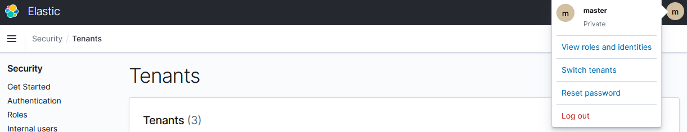
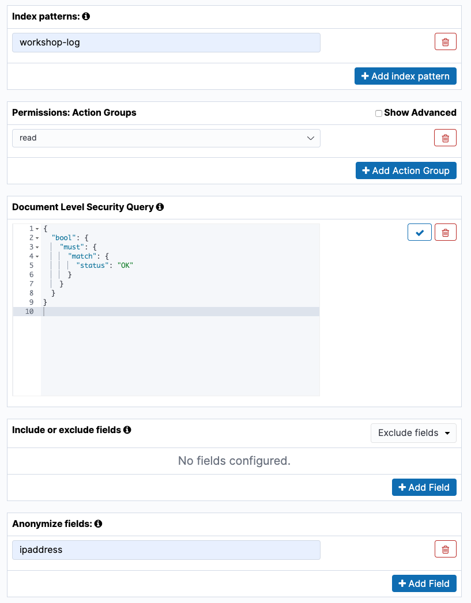
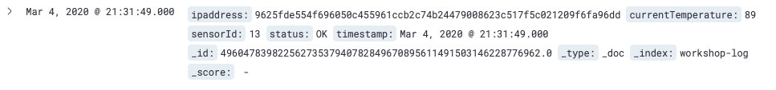
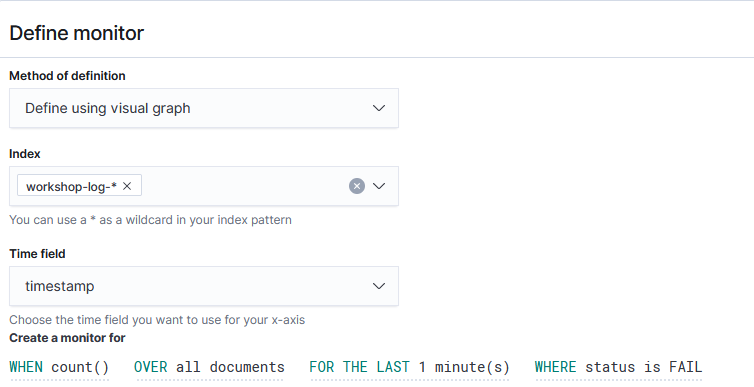

# Lab 3: Amazon ES の運用管理

前の Lab ではビジュアルの作成や分析といった，Kibana の基本的な使い方を実際に試してきました．この Lab では，権限管理やアラート，index 管理といった，運用管理に関する事柄について，実際に手を動かして試していただきます．

## Section 1: Amazon ES の権限管理

Lab 1 で Amazon ES をセットアップして，Kibana にログインする際に，ユーザー名とパスワードによる認証がありました．そこではマスターユーザーのアカウントを使ってログインしました．しかし多くのユーザーが Kibana を使って分析を行う際に，同じマスターアカウントを使い回すわけにはいきません．ユーザーごとに個別のアカウントを作成し，さらにユーザーの役割に合わせた限られた権限のみを付与するのが正しいやり方といえます．

そこでこのセクションでは，IoT 事業部のユーザーを想定して，そのユーザーたちだけに先ほど作成したダッシュボードを公開することを考えます．また IoT 事業部のユーザーの中でも，編集権限を持つ開発者と，限られた閲覧権限だけを持つ閲覧者に分けて，それぞれに公開する範囲を制限したいと思います．

### テナントの作成とデータのコピー

まず，IoT 事業部のユーザーだけに公開するためのスペースを作成したいと思います．限られた人だけに公開する範囲を，Amazon ES の Kibana ではテナントという概念であらわします．デフォルトでは，作成したユーザー自身だけがアクセスできる Private テナントと，全ユーザーに共有される Global テナントがあります．ここに IoT 事業部向けの新しいテナントを追加していきましょう．

1. 画面左側の  アイコンをクリックして，**[Security]** の画面を開きます
1. 画面左側の **[Tenants]** をクリックして，テナント編集画面に進みます．画面右側の **[Create tenant]** ボタンをクリックして，新規テナント作成を行います
1. **"Name"** に **"IoT"** と入力したら，**[Create]** を押します

続いて，既存のインデックスパターン，ビジュアル，そしてダッシュボードデータをエクスポートします．

1. 画面左側の  アイコンをクリックして，**[Stack Management]** の画面を開きます．次に，画面左側の **[Saved Objects]** を選択します
2. 画面に，Lab 2 で作成したインデックスパターン，ビジュアル，ダッシュボードが一覧で表示されます．これらの要素全てにチェックをつけて，右上の **[Export]** を押してください．これらの設定が書かれた JSON ファイルがダウンロードされます

次にテナントを切り替えて，データのコピーを行います．
1. 画面右上のユーザーアイコンをクリックし，**"Switch tenants"** を選択します．
  
1. **"Select your tenant"** ダイアログにて **"Choose from custom"** を選択し，プルダウンリストから **"IoT"** を選択し **[Confirm]** ボタンを押しテナントを切り替えます
1. 画面左側の  アイコンをクリックして，**[Stack Management]** の画面を開きます．次に，画面左側の **[Saved Objects]** を選択します
1. 画面右上の **[Import]** ボタンを押して，先ほどの JSON ファイルを選択してアップロードします．これで画面に先ほどのダッシュボードやビジュアルがコピーされました

### 新しい Amazon ES ロールの作成

次に，IoT 事業部用のユーザーに割り当てるための，Amazon ES の権限セットであるロールを作成します．ここでは，編集権限を持つ開発者と，限られた閲覧権限だけを持つ閲覧者のそれぞれに向けた，2 種類のロールを作成します．まずは開発者用のロール作成からいきます．

1. 画面左側の  アイコンをクリックして，**[Security]** の画面を開きます
1. **[Get started]** セクションで **[Create new Role]** をクリックします
1. **"Name"** に **"iot_developer_role"** と入力します
1. **[Index permissions]** セクションに移動します．**"Index"** に **"workshop-log-*"** と入力します．続いて **"Index permissions"** に **"crud"** を追加します
1. **[Tenant Permissions]** セクションに移動し，**"Tenant"** に **"IoT"** を選択します
1. 画面下の **[Create]** ボタンを押してロールを作成します

同様に，閲覧者用のロールも作成しましょう．

1. 画面左側の  アイコンをクリックして，**[Security]** の画面を開きます
1. **[Get started]** セクションで **[Create new Role]** をクリックします
1. **"Name"** に **"iot_reader_role"** と入力します
1. **[Index permissions]** セクションに移動します．**"Index"** に **"workshop-log-*"** と入力します．続いて **"Index permissions"** に **"read"** を追加します．次の **"Document Level Security Query"** は，以下のような文字列を入力してください．これは workshop-log データのうち，status フィールドが OK のものだけを表示させるようにするための，Elasticsearch クエリです．最後に **"Anonymization"** に **"ipaddress"** と入力します．以下に示すような設定結果になります

   ```json
   {
     "bool": {
       "must": {
         "match": {
           "status": "OK"
         }
       }
     }
   }
   ```
   
1. **[Tenant Permissions]** セクションに移動し，**"Tenant"** に **"IoT"** を選択します．また **"Tenant"** の右隣のプルダウンメニューから **[Read Only]** を選択します
1. 画面下の **[Create]** ボタンを押してロールを作成します

### Kibana ユーザーのセットアップとロールの紐付け

それでは Kibana にログインするためのユーザーを作成しましょう．

1. 画面左側の  アイコンをクリックして，**[Security]** の画面を開きます
1. **[Get started]** セクションで **[Create internal user]** をクリックします
1. **"Username"** に **"iot_developer"**，**"Password"** および **"Re-enter Password"** に適当な文字列を入力したら，**[Create]** ボタンを押します
1. 同様に閲覧ユーザーも作成します．画面右上の **[Create internal user]** ボタンを押して新規ユーザー作成画面を立ち上げます．**"Username"** に **"iot_reader"**，**"Password"** および **"Repeat Password"** に適当な文字列を入力したら，**[Create]** ボタンを押します

最後に，作成したユーザーと先ほど用意したロールを紐付けましょう．

1. 画面左側の  アイコンをクリックして，**[Security]** の画面を開きます
1. **[Security]** ページの左メニューから **[Roles]** を選択して，ロール一覧を開きます
1. **"Roles"** の一覧から，**"iot_developer_role"** を選択します．
1. **[Mapped users]** タブを選択し，**[Manage mapping]** ボタンを押します
1. **"Users"** のプルダウンリストから **"iot_developer"** を選択し, **"Map"** ボタンを押します
1. 閲覧者についても同様に対応します. ロール **"iot_reader_role"** をユーザー **"iot_reader"** に紐づけます
1. さらに Kibana UI を使用するために，Amazon ES 側で事前に定義されている **"kibana_user"** ロールを，開発者 **"iot_developer"** と閲覧者 **"iot_reader"** の両方に紐づけます

以上でテナントの作成，ロールとユーザーの作成，紐付けまで完了しました．それでは実際に，作成したユーザーでログインしてみて，想定した通りの権限が許可されているかを確認してみましょう

### 作成したユーザでログインして権限の確認

まずは iot_developer でログインしてみましょう．

1. Kibana 画面の右上にあるユーザーアイコンをクリックして，Kibana から一旦ログアウトしてください．ログイン画面に戻ったら，先ほど作成した iot_developer のアカウントでログインしてください
1. ログイン後の画面左側メニューに **"Security"** がないことが確認できるでしょう．iot_deveoper ユーザーは管理者権限を持っていないため，このメニューにアクセスできません
1. 画面右上のユーザーアイコンをクリックして，**"Switch tenants"** から IoT テナントに切り替えてください
1. それから Discover，Visualize，Dashboards 等にアクセスでき，かつ検索やビジュアルの作成ができることを確かめてください

次に iot_reader でログインしてみます．

1. Kibana 画面の右上にあるユーザーアイコンをクリックして，Kibana から一旦ログアウトしてください．ログイン画面に戻ったら，先ほど作成した iot_reader のアカウントでログインしてください
1. 画面右上のユーザーアイコンをクリックして，**"Switch tenants"** から IoT テナントに切り替えてください
1. Discover ページを開いて，対象データの時間範囲を適当に調整し，データを表示させてください．以下のように，ip_address カラムがハッシュ化されているのが確認できます．これは先ほど作成した iot_reader_role の anonymized fields にこの ipaddress カラムを指定していたためです．
   
1. また，Dashoboards ページを開くと，以下のように "Percentage of Status" が OK のものしかないのがみて取れるかと思います．これも status カラムが OK のもののみを閲覧可能とするように設定していたためです．また IP アドレスがハッシュ化されているため，Private IP とそれ以外の時系列推移も，グラフが表示されていません
   

ここまでの確認が完了したら，iot_reader からログアウトして，**再度 Lab 1 で作成したマスターユーザーで Kibana にログインし直して**ください．Section 2 以降を進めるために必須となります．

## Section 2: Amazon SNS へのアラートの送信

Amazon ES でできることは，ダッシュボードを用いて可視化するだけではありません．特定の数値が基準を超えた場合に，通知を飛ばして対応を促すと言ったこともできます．例えば機器ログの収集を行っている場合に，ステータスがエラーのログが一定数以上来たら，管理者にアラートメールを送るといったパターンが考えられます．そこでここでは，Lab 1 で設定した SNS トピックに対して，実際に通知を飛ばしてみたいと思います．

Amazon ES におけるアラートの仕組みは以下の通りです．今回の例では，監視対象のメトリクスとしてログに含まれる FAIL ステータスの数を 1 分おきに監視します．そして 1 分間に FAIL ステータスを含んだログが 2 回以上得られたら，アクションとして SNS トピック経由でアラートメールを送信する，という流れになります．


### Destination の設定

まず最初に，アクションの送信先の設定を行います．ここでは，Lab 1 で作成した SNS トピックを送信先に指定します．

1. 画面左側のメニューから，**"Alerting"** を開きます
1. メニューから **[Destinations]** タブを選択して，右側の **[Add destination]** ボタンを押します
1. **"Name"** に **"Amazon ES alert topic"** と入力します．**"Type"** プルダウンから **[Amazon SNS]** を選択してください．**"Settings"** の **"SNS Topic ARN"** および **"IAM role ARN"** には，Lab 1 で作成した SNS トピックと IAM ロールの ARN を入れてください
   - **SNS Topic ARN**: `arn:aws:sns:ap-northeast-1:123456789012:amazon_es_alert` のような文字列
   - **IAM role ARN**: `arn:aws:iam::123456789012:role/amazones_sns_alert_role`のような文字列
1. **[Create]** ボタンを押します 

### Monitor の設定

次に Monitor 機能で監視対象のメトリクス，および頻度を設定します．ここでは送られてくるログの status フィールドの値が FAIL である回数を，1 分に 1 回カウントします．

1. 画面左側のメニューから，**"Alerting"** を開きます
1. メニューから **[Monitors]** タブを選択して，右側の **[Create monitor]** ボタンを押します
1. Monitor 作成画面が開いたら，**"Monitor name"** に **"FAIL status monitor"** と入力します．続けて **"Define monitor"** カテゴリの中で，**"Index"** に **"workshop-log-*"** と入力，**"Time field"** として **[timestamp]** を選びます．次に **"Create a monitor for"** のクエリを，`WHEN count() OVER all documents FOR THE LAST 1 minute(s) WHERE status is FAIL ` とします．すべて設定すると以下のようになります
   
1. **[Create]** ボタンを押して Monitor を作成します．Monitor を作成すると，そのまま Trigger の作成画面に遷移します

### Trigger の設定

続けて Trigger のセットアップを行なっていきましょう．ここでは，FAIL ステータスが 2 回以上あったらアラートをあげるとします．

1. **"Trigger name"** に **"FAIL count trigger"** と入力します．**"Severity level"** は **[3]** にしておきましょう．**"Trigger condition"** を`IS ABOVE 1` とします．これにより，1 より上 = 2 回のアラートが上がった時に，トリガーが発動します

1. 次に下側の **"Configure actions"** に進みます．**"Action name"** に **"Too many FAIL notification"** と入力します．"Destination" のプルダウンから，先ほど作成した **[Amazon ES alert topic - (Amazon SNS)]** を選択してください．**"Message subject"** は **"FAIL ステータスのレコード数が閾値を超えました"** としましょう

1. "Message" は，最初かあるメッセージを消して，以下の内容に置き換えてください

   ```
   監視項目 {{ctx.monitor.name}} でアラートが検出されました．状況を確認してください．
   - トリガー: {{ctx.trigger.name}}
   - 緊急度: {{ctx.trigger.severity}}
   - 集計開始時刻: {{ctx.periodStart}}
   - 集計終了時刻: {{ctx.periodEnd}}
   ```

1. **[Create]** ボタンを押して，Trigger を作成します

以上で設定は完了です．

### 結果の確認

FAIL status monitor のページを開くと，History のところにアラートの履歴が表示されているのが確認できるでしょう．


また数分間待つと，アラートメッセージが設定したメールアドレスに届くとともに，アラート履歴にも Triggered が表示されます．


またアラートが上がると，**[Dashboard]** タブのリストにアラートが表示されるので，左側のチェックボックスを選択して，右の **[Acknowledge]** ボタンを押すことで，アラートを止めることができます．ただ，同様の状況が発生するとまた新たなアラートが上がってきてしまい，メールも送られ続けるため，確認が終わったら **[Monitors]** タブから，作成した Monitor のチェックボックスを選択して，**[Actions]** ボタンの **[Disable]** をクリックしてください

## Section 3: index の管理

Lab 1 と 2 で説明したように，Amazon ES のデータは基本的に index という単位で管理されます．このワークショップでは，Firehose からログを挿入する際に，格納先の index 名を定期的に新しいものにしていくやり方をとっています．Lab 2 で実施してきたようなログ分析のユースケースでは，通常最近のデータは頻繁に処理対象になりますが，一定の時間が経ったデータは滅多にアクセスされなくなるのが一般的です．

今回のように 1 時間ごとに新しい index が作成される場合，滅多にアクセスされない大量の古い index を保存するために，大きなディスク容量が必要となってしまいます．そこで古い index を自動で削除できるように設定したいと考えるのは自然でしょう．また大量のアクセスがあった場合に，index サイズが膨れ上がってしまい，分析のパフォーマンスに影響を及ぼすことも考えられます．その場合，一定サイズを超えたら新しい index を自動的に作成して，そちらに書き込みを行えると，Amazon ES を安定して運用できるでしょう．

このような index 管理を可能とする機能として，Amazon ES には Index State Management という機能があります．ここでは，新しい index が生成されてから 7 日間経ったら，自動でログを削除するような設定を適用したいと思います．

### Index policy の作成

index の運用ルールを記述した JSON 形式の設定ファイルを，Amazon ES では，index policy と呼びます．index 作成が行われてから 7 日間経過したら，index を自動で削除する index policy を作成していきます．

1. 画面左側のメニューから，**"Index Management"** を開きます

1. 左側メニューの **[State management policies]** のメニューを選択した状態で，右の **[Create policy]** ボタンを押します

1. **”Policy ID"** に **"delete_after_1week"** と入力してください

1. すでにデフォルトのポリシーが記述されていますが，今回はこれを使いません．以下の内容をコピーして，**"Define policy"** に貼り付けてください．シンプルな記述なので，みていただければ意味は大体理解できるかと思います

   ```json
   {
       "policy": {
           "description": "Delete index 1 week after.",
           "default_state": "live",
           "states": [
               {
                   "name": "live",
                   "actions": [
                       {
                           "read_write": {}
                       }
                   ],
                   "transitions": [
                       {
                           "state_name": "delete",
                           "conditions": {
                               "min_index_age": "7d"
                           }
                       }
                   ]
               },
               {
                   "name": "delete",
                   "actions": [
                       {
                           "delete": {}
                       }
                   ],
                   "transitions": []
               }
           ]
       }
   }
   ```

1. **[Create]** ボタンを押して，ポリシーを作成します

### Index policy を既存の index に適用

作成したポリシーを実際に既存の index に適用しましょう．

1. 左側メニューで **"Indices"** を選択します．index の一覧から，**[workshop-log-2020-04-01-09]** のような（日付部分は，ワークショップの実施時間に合わせた異なる値が入ります）index について，左側チェックボックスを選択してから左上の **[Apply policy]** ボタンを押します
1. ポップアップが出たら，先ほど作成した **"delete_after_1week"** を選択して，**[Apply]** ボタンを押します
1. 左側メニューの **[Policy managed indices]** を選択すると，index に ポリシーが適用されているのが確認できるかと思います

### Index policy を今後作成される index に適用 (Elasticsearch 7.10 以降のバージョン)

上で試したやり方だと，既存の index に対してポリシーを適用することはできますが，今後新しく作られるポリシーに対しての設定をあらかじめ行うことはできません．index が作られるごとに毎回手動でこの設定を行うのは面倒なので，ポリシーが自動適用されるように設定を変更しましょう

1. 画面左側のメニューから，**"Index Management"** を開きます
1. 左側メニューの **[State management policies]** のメニューを選択した状態で，先ほど作成した **"delete_after_1week"** ポリシーを選択します
1. ポップアップが表示されたら， **[Edit]** ボタンをクリックします
1. ポリシーを下記の通り変更します. 差分は **"ism_template"** セクションの有無のみです

   ```json
   {
       "policy": {
           "description": "Delete index 1 week after.",
           "default_state": "live",
           "states": [
               {
                   "name": "live",
                   "actions": [
                       {
                           "read_write": {}
                       }
                   ],
                   "transitions": [
                       {
                           "state_name": "delete",
                           "conditions": {
                               "min_index_age": "7d"
                           }
                       }
                   ]
               },
               {
                   "name": "delete",
                   "actions": [
                       {
                           "delete": {}
                       }
                   ],
                   "transitions": []
               }
           ],
           "ism_template": {
               "index_patterns": ["workshop-log-*"],
               "priority": 100
           }
       }
   }
   ```
1. 新しい index は 1 時間に一度しか作られないため，ここでは手動で新しい index を作成してみましょう．画面左側のメニューから，**"Dev Tools"** を開き，次の内容をコピーし， ▶︎ ボタンを押してください

   ```json
   POST workshop-log-policy-test/1
   {
     "id": "test"
   }
   ```

1. 続いてポリシーが適用されたことを確認しましょう. コンソールから適用結果を確認することも可能ですが，今回は API を使用して確認してみたいと思います．Dev Tools に次の内容をコピーし， ▶︎ ボタンを押してください

   ```
   GET _opendistro/_ism/explain/workshop-log-policy-test
   ```
  
1. 以下のように, index と policy_id の紐づけが行われていることが確認できます

   ```json
   {
       "workshop-log-policy-test" : {
        "index.opendistro.index_state_management.policy_id" : "delete_after_1week",
        "index" : "workshop-log-policy-test",
        "index_uuid" : "xtMovQxUR7qlk0qToBodYw",
        "policy_id" : "delete_after_1week",
        "enabled" : true
        },
        "total_managed_indices" : 1
   }
   ```

### Index policy を今後作成される index に適用 (Elasticsearch 7.10 より前のバージョン)

7.10 以前のバージョンでは，同様の設定を適用するために Elasticsearch の API を直接叩く必要があります．そこで API を叩くための Dev Tools と呼ばれる UI を使用します．

1. 画面左側のメニューから，Dev tools のメニューを開きます

1. 下の **"Console"** にあらかじめ書かれている内容をそのまま残しておいて，1 行空けてその下に，以下の内容をコピーしてください．これは，**"workshop-log-*"** に適合するすべての index に対して，作成時に自動で **"delete_after_1week"** ポリシーを適用する，というものです

   ```json
   PUT _template/index_policy_templete
   {
     "index_patterns": ["workshop-log-*"], 
     "settings": {
       "opendistro.index_state_management.policy_id":  "delete_after_1week" 
     }
   }
   ```

1. コピーしたコマンドの右側に表示される ▶︎ ボタンを押して，API を実行してください，以下のような結果が右側の画面に表示されたら成功です

   ```json
   {
     "acknowledged" : true
   }
   ```

   

1. 新しい index は 1 時間に一度しか作られないため，ここでは手動で新しい index を作成してみましょう．**"Console"** の内容をそのままに，1 行空けて次の内容をコピーし， ▶︎ ボタンを押してください

   ```json
   POST workshop-log-policy-test/1
   {
     "id": "test"
   }
   ```

1. 次のような内容が表示されれば，無事新しい index が作成されました

   ```json
   {
     "_index" : "workshop-log-policy-test",
     "_type" : "1",
     "_id" : "Hsi7qnABvXnwMeRuRS2W",
     "_version" : 1,
     "result" : "created",
     "_shards" : {
       "total" : 2,
       "successful" : 1,
       "failed" : 0
     },
     "_seq_no" : 0,
     "_primary_term" : 1
   }
   
   ```

6. 実際に新しい index にポリシーが適用されてるか確認するため，画面左側のメニューから，Index Management のメニューを開きます

7. 左側メニューの **[Policy managed indices]** を選択すると，以下のように今作成した index に対して policy が適用され，Running ステータスであることが確認できるかと思います．以後新しく作られる，**"workshop-log-*"** 形式の index には，このポリシーが適用されます
   

以上で index の管理の説明は終わりです．今回は非常に簡単なポリシーを試しましたが，実際にはもっと幅広いポリシーを設定することが可能です．詳細は[こちら](https://docs.aws.amazon.com/ja_jp/elasticsearch-service/latest/developerguide/ism.html)をご確認ください

## まとめ

Lab 3 では，Amazon ES の運用管理に関わるさまざまな機能について，実際に試してきました．非常に多くのことを簡単に管理できることが帆理解いただけたかと思います．それでは次の [Lab 4](../lab4/README.md) で，より高度な Amazon ES の使い方についてみていきましょう